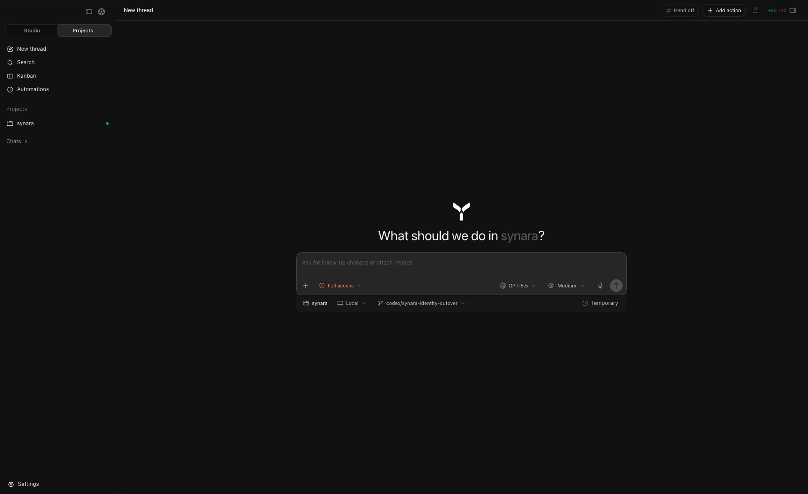

# Synara

Synara is a local-first desktop app for coding with the AI agents and subscriptions you already use.

It brings chats, terminals, browser previews, diffs, branches, provider sessions, and handoffs into one focused workspace so you can run agent work without juggling a dozen windows.



## What it does

- Use the AI accounts you already pay for: Claude Code, Codex, Gemini, OpenCode, Cursor, Grok, Kilo Code, and Pi.
- Run parallel work across projects, threads, and isolated Git worktrees without branches stepping on each other.
- Keep split chats, terminals, browser previews, and agent output visible in the same window.
- Hand off a thread to another provider when you want a second model to pick up with the same context.
- Review diffs, create branches, commit, push, and open PRs from the app.
- Keep your workspace local. Synara stores chats, projects, and history on your machine and talks directly to the providers you choose.

## How to use

> [!WARNING]
> You need to have [Codex CLI](https://github.com/openai/codex) installed and authorized for Codex sessions to work.

Install the [desktop app from the Releases page](https://github.com/Emanuele-web04/Synara/releases), or download it from [trysynara.com](https://www.trysynara.com/).

You can also run Synara locally while the project is still early:

```sh
bun install
bun run dev
```

## Privacy

Synara runs as the workspace layer on your machine. There is no Synara cloud holding your repositories, chats, or project history.

The provider you choose still receives the prompts, file snippets, diffs, terminal output, or tool results needed for a session, but that traffic goes to the provider you picked rather than through a separate Synara-hosted workspace.

## Some notes

Synara is still very early. Expect bugs, rough edges, and fast-moving internals.

Focused issues and PRs are welcome, especially bug fixes, reliability fixes, and small maintenance improvements.

## Contributing

Read [CONTRIBUTING.md](./CONTRIBUTING.md) before opening an issue or PR.

Need support? Join the [Discord](https://discord.gg/jn4EGJjrvv).
