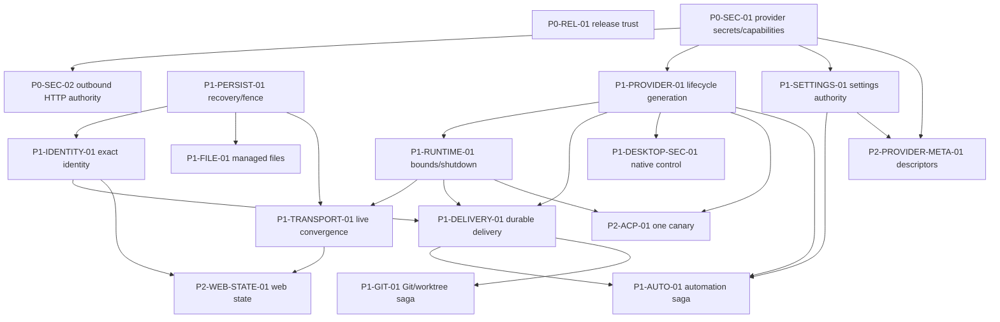

# Synara Focused Codebase Roadmap

> **Superseded:** this is the historical implementation roadmap. The current, evidence-backed audit
> and integrated TODO list live in [`PR357_MERGE_READINESS_AUDIT.md`](./PR357_MERGE_READINESS_AUDIT.md).
> Keep this file only for the detailed history of work already performed.

## Audit scope and constraints

This roadmap replaces the previous broad audit with the smallest evidence-backed set of work that materially improves Synara's correctness, security, reliability, performance, maintainability, and provider/ACP foundation.

- Scope reviewed: all 206 finding sections in the previous audit (204 unique identifiers; two identifiers appeared twice), current source, and the dirty worktree.
- Actionable cap: 17 workstreams across P0-P2. P3 is intentionally empty; P4/P5 items are not tracked individually.
- Evidence rule: file size, style, or hypothetical scale is not sufficient. Each task below names a demonstrated faulty authority, unbounded hot path, conflicting state owner, or repeated implementation.
- Execution rule: implement one authority/subsystem per branch or review batch. Do not mix persistence migrations, desktop security, provider cutover, and frontend cleanup.
- Verification rule: commands under **Future verification** are instructions for future executors unless an implementation-status line explicitly records a focused passing run.
- Mutation rule: the initial audit rewrite changed documentation only. Later implementation phases are recorded in place; unrelated dirty-worktree changes remain authoritative and must be preserved.

### Reduction accounting

The previous 206 finding sections are accounted for as follows:

- 126 open finding sections remain valuable and are consolidated into the 17 workstreams below: 109 net merges.
- 63 finding sections were removed as P4/P5, duplicate symptoms, speculative work, or work without enough leverage.
- 17 implemented finding sections remain only in **Completed foundation**.
- The two duplicated identifier occurrences were reviewed in place and counted as sections above; `VERIFY-ALL` became policy rather than an actionable finding.

## Current worktree reality

### Pruning checkpoint — 2026-07-14

Roadmap expansion is frozen because the authoritative dirty diff has outgrown a reviewable change.
Unopened workstreams remain recorded but must not start during this checkpoint. Work is limited to
existing changed code and must prefer deletion, merged ownership, and movement of coherent units out
of the five named hotspots: `ProviderRuntimeIngestion`, `ProviderCommandReactor`,
`ProjectionPipeline`, `ProviderService`, and `wsRpc`. Each runtime phase must be net-negative LOC;
migrations/recovery are the only exception. No compatibility path may be added unless it replaces an
existing path and states when the old path is deleted.

For ACP, do not expand `effect-acp`. The official TypeScript SDK now owns the production wire for all
three ACP providers, and the competing production branch is deleted. The shortened desktop,
settings, automation, web-state, and provider-metadata phases are code-complete. ACP wire ownership
is complete, but the bounded raw-input criterion is reopened by the audit sweep below. Git handoff
now spans RPC, a durable workflow journal, and orchestration under one server owner. Completed Git
results replay into the same idempotent metadata command after restart; pre-result interruptions are
fenced as `uncertain` rather than silently rerunning filesystem mutations.

### Full-scan checkpoint — 2026-07-14

This checkpoint does not open a new workstream. It rechecks the current implementation against the
existing Effect, desktop IPC, WebSocket, lifecycle, and ACP acceptance criteria.

- **Fixed — invalid Effect service execution.** `wsRpc` executed
  `CurrentManagedAttachmentPrincipal` and the Git/provider runtime layers executed
  `ProviderCredentials` as first-class Effects. In the installed Effect version, both are yieldable
  ServiceMap tags but are not valid Effect values; the failure is `Fiber.runLoop: Not a valid effect:
Service`, surfaced to clients as an interrupted RPC. All three paths now acquire the service with
  `yield*`. The two credential consumers share one owner in `providerCredentials.ts`, and a focused
  regression test covers the invariant. A repository-wide scan across 93 ServiceMap definitions now
  reports zero remaining tag-as-Effect patterns; focused server verification passes 11/11.
- **Verified — desktop IPC consolidation.** All 49 desktop IPC channel leaves have both a producer and
  consumer in the main/preload/browser/voice/storage paths. The strings now have one data-only owner
  in `ipcChannels.ts`; no duplicate `desktop:*` literal remains elsewhere in desktop source.
- **Current diff accounting.** Runtime source is **-24 LOC** (`144` tracked additions plus the 64-line
  IPC contract, against `232` deletions). The focused 26-line regression test makes the implementation
  slice **+2 LOC**; audit documentation is accounted separately. This is not a return to the previous
  +34,024-LOC commit.
- **Reopened — ACP raw-input resource boundary.** `AcpSessionRuntime` gives the official SDK a
  push-driven `ReadableStream`: an unscoped `Effect.runFork` drains child stdout and calls
  `controller.enqueue` without observing `desiredSize`. A slow SDK consumer can therefore accumulate
  chunks despite the Web Stream high-water mark. The official SDK's `LineBuffer` also retains an
  unterminated line without a byte ceiling. The current 512-message conformance test uses a separate
  pull-driven stream under 64 KiB, so it does not prove the production bridge is bounded. Official SDK
  wire ownership remains correct; only the already-required Synara admission layer is incomplete.

Short remaining TODO:

- [x] Replace every discovered ServiceMap-tag-as-Effect path and add one focused regression gate.
- [x] Verify the 49-channel desktop IPC contract after preload consolidation.
- [ ] Replace the existing ACP `ReadableStream.start` + unscoped `Effect.runFork` bridge with one
      scope-bound, backpressured raw-byte admission path. It may count bytes/newlines but must not parse
      JSON-RPC, recreate SDK schemas, or fall back to `effect-acp`; the old bridge is deleted in the same
      change.
- [ ] Prove the actual production ACP adapter (not a synthetic pull stream) stays within a declared
      frame/queue budget under a slow consumer and fails closed on oversize/unterminated input. Keep this
      as one focused integration fixture, not a new test framework.

Pruning log: `PRUNE-01` removed duplicate projected-thread reads and dead approval-error control flow
from `ProviderCommandReactor` (**-8 runtime LOC**); focused approval forwarding/stopped-session gates
pass 2/2. Remaining deletion target is the shared claim/failure envelope still duplicated between
approval and user-input response branches.

`PRUNE-02` merged that claim/failure envelope into one existing reactor path (**-18 runtime LOC**),
leaving only provider-specific response payloads separate; focused interaction gates pass 6/6.
`PRUNE-03` then replaced three copies of the replay-safe/external claimed-intent expression and its
overlapping external-claim alias with one classifier (**-7 runtime LOC**); focused ordered delivery,
reclaim, quarantine, and retry gates pass 5/5. `PRUNE-04` preserved the distinct immediate and recovery
journal drains, but merged the duplicated Codex-steer and ordinary-request synthetic turn/assistant
flush tails in runtime ingestion (**-14 runtime LOC**); focused delivery-mode gates pass 3/3. Remaining
hotspot work moved to projection, where `PRUNE-05` made the full projection entry point compose the
existing hot/deferred paths instead of owning a third application branch (**-13 runtime LOC**); focused
phase/rollback gates pass 3/3. `PRUNE-06` merged ProviderService's duplicated approval/user-input route,
active-session, lifecycle-generation, and lock ownership (**-26 runtime-path LOC**); focused interaction
generation gates pass 4/4. RPC ownership remains; edit only where an existing path can be deleted.
`PRUNE-07` merged fourteen copies of the wsRpc Git mutation/status-refresh tail into one in-file owner
(**-4 runtime LOC**); existing wsRpc auth/negotiation gates pass 6/6, and no missing Git-handler test
scaffold was added. The five named hotspots have now produced **-90 LOC** cumulatively. Remaining work
is further evidenced deletion plus the official ACP canary boundary/deletion map below. `PRUNE-09`
then removed ProviderService's duplicated read of the same idle-stop environment variable (**-2
runtime LOC**); direct inspection and `git diff --check` are sufficient because the expression's value
is unchanged. `PRUNE-10` merged eight pinned-message/marker projector persistence shells into one
existing-row update owner (**-60 runtime LOC**), while leaving each payload transform explicit; focused
round-trip gates pass 2/2. `PRUNE-11` reused that owner for five simple mode/lifecycle mutations while
preserving attachment cleanup ordering and leaving effectful projector paths separate (**-38 runtime
LOC**); focused runtime-mode/delete gates pass 2/2. Cumulative pruning runtime change: **-190 LOC**.
`PRUNE-12` merged ProviderService's live-session and persisted-thread stop-all writers and now visits
their thread-id union once, deleting the second directory write for active sessions while retaining
their resume cursor and full runtime payload (**-2 runtime LOC**); the focused stopped-binding and
adapter-cleanup-failure gate passes 1/1. Cumulative pruning runtime change: **-192 LOC**. Remaining
work is deletion-only inspection of the same five hotspots; ACP runtime cutover remains frozen.
`PRUNE-13` removed the approval and structured user-input handlers' duplicate null-command guards;
`claimInteractionResponse` already returns null before resolving a provider thread when the command
id is absent (**-2 runtime LOC**). Both focused interaction-forwarding gates pass 2/2. Cumulative
pruning runtime change: **-194 LOC**.
`PRUNE-14` deleted ProviderService's three dead `adapterReturned` variables and the matching finalizer
parameter. Effect construction captured each flag before its dispatch generator ran, so the value was
always false; `finishTurnDispatch` now states that existing retained-result condition directly (**-7
runtime LOC**). Focused overlapping-dispatch ownership/promotion gates pass 2/2. Cumulative pruning
runtime change: **-201 LOC**. The larger dispatch envelopes remain intentionally unabstracted during
this checkpoint.
`PRUNE-15` merged ProviderRuntimeIngestion's three parallel tool-lifecycle activity-row constructors
into one switch branch while preserving update/completion context-compaction semantics (**-55 runtime
LOC**). Focused compaction progress/terminal gates pass 2/2. The existing started and P1 lifecycle
harness cases timed out before the mapper was reached, including with a temporary probe that was then
removed; they are recorded as deferred rather than green, and no test scaffold was added. Cumulative
pruning runtime change: **-256 LOC**.
`PRUNE-16` merged ProjectionPipeline's duplicate activity-history repository replacement paths for
revert and conversation rollback. Each event still computes retained rows with its existing rule,
then one branch owns the empty/no-change checks and delete/reinsert sequence (**-18 runtime LOC**).
Existing destructive-history integration gates pass 3/3; no activity-only scaffold was added.
Cumulative pruning runtime change: **-274 LOC**.
`PRUNE-17` merged the adjacent proposed-plan revert/rollback repository replacement paths while
preserving their distinct turn-count and removed-turn-id retention functions (**-20 runtime LOC**).
Direct inspection and `git diff --check` prove the ownership merge; there is no focused proposed-plan
destructive-history fixture, and none was added. Cumulative pruning runtime change: **-294 LOC**.
`PRUNE-18` merged message-history revert/rollback repository replacement and retained-attachment
registration while leaving rollback's zero-turn and prune-suppression rules and revert's turn-count
selector explicit (**-11 runtime LOC**). Focused revert, rollback, and managed/legacy attachment gates
pass 3/3. Cumulative pruning runtime change: **-305 LOC**.
`PRUNE-19` merged turn-history revert/rollback load, delete, and reinsert ownership while retaining
revert's unconditional checkpoint-count rebuild and rollback's no-change exit plus pending-turn-start
restoration (**-15 runtime LOC**). Existing destructive-history gates pass 3/3; there is no dedicated
pending-turn rollback fixture, and none was added. Cumulative pruning runtime change: **-320 LOC**.
`PRUNE-20` merged wsRpc's duplicate orchestration high-water Effect and identical capture-error mapping
for shell and thread cursor-safe streams while leaving snapshot and replay policies separate (**-3
runtime LOC**). Direct equivalence and `git diff --check` are the available evidence; no focused
stream-constructor fixture exists. Cumulative pruning runtime change: **-323 LOC**.
`PRUNE-21` replaced five repeated assistant-delivery binding state envelopes with one local next-state
object in each existing `Ref.modify` callback; map mutations, matching, debt accounting, and cache
binding are unchanged (**-25 runtime LOC**). Focused same-thread ordering, Codex steer, and settled
unmatched-debt gates pass 3/3. Cumulative pruning runtime change: **-348 LOC**.
`PRUNE-22` merged ProviderRuntimeIngestion's canonical request opened/resolved approval activity
constructors while retaining requested summary/detail and resolved decision semantics (**-19 runtime
LOC**). The focused canonical request lifecycle gate passes 1/1. Cumulative pruning runtime change:
**-367 LOC**.
`PRUNE-23` consolidated ProviderCommandReactor's duplicated first-turn branch/title rename input while
leaving their separate fibers and branch-only workspace metadata intact (**-4 runtime LOC**). Focused
title and temporary-worktree branch rename gates pass 2/2. Cumulative pruning runtime change:
**-371 LOC**.
`PRUNE-24` moved the deferred non-streaming user-message timestamp mutation onto ProjectionPipeline's
existing `updateThreadProjection` load/missing/upsert owner while leaving its transform local and all
effectful summary rebuilds separate (**-10 runtime LOC**). Direct equivalence and `git diff --check`
are the available evidence; the only timestamp fixture covers the unchanged streaming-assistant exit.
Cumulative pruning runtime change: **-381 LOC**.
`PRUNE-25` moved synchronous thread metadata patches onto the same existing-row update owner while
keeping sparse patch construction and branch-change reset semantics local (**-6 runtime LOC**).
Direct branch equivalence and `git diff --check` are the available evidence; no focused metadata
projection fixture exists. Cumulative pruning runtime change: **-387 LOC**.
`PRUNE-26` removed ProviderCommandReactor's duplicate conversation-rollback completion command by
making provider interruption/rollback conditional on a positive turn count and converging both paths
on one dispatch (**-14 runtime LOC**). Focused provider rollback and active-turn interruption gates
pass 2/2; the zero-turn path is directly equivalent but has no dedicated fixture. Cumulative pruning
runtime change: **-401 LOC**.
`PRUNE-27` removed three one-use parsed attachment thread-segment aliases and redundant falsy checks;
`null`/empty results already fail the required string equality, so deletion and prune ownership rules
are unchanged (**-3 runtime LOC**). Direct equivalence and `git diff --check` are sufficient.
Cumulative pruning runtime change: **-404 LOC**.
`PRUNE-28` converged pending-interaction requested, resolved, and provider-response-failure activities
onto one repository upsert and shell-count tail while preserving each branch's lifecycle,
response-command, and settlement validation (**-16 runtime LOC**). Focused approval and user-input
projection gates pass 2/2. Cumulative pruning runtime change: **-420 LOC**.
`PRUNE-29` merged ProviderRuntimeIngestion's structured user-input requested/resolved activity
constructors while retaining questions and answers as explicit payload variants (**-18 runtime LOC**).
The focused request-and-resolution projection gate passes 1/1. Cumulative pruning runtime change:
**-438 LOC**.
`PRUNE-30` reused ProviderCommandReactor's existing first-turn message/model/provider payload for the
subsequent provider dispatch while retaining dispatch-only skills, mentions, runtime, review, and mode
fields locally (**-9 runtime LOC**). The focused normal turn-start/session/send gate passes 1/1.
Cumulative pruning runtime change: **-447 LOC**.
`PRUNE-31` consolidated ProviderCommandReactor's provider start/restart and native-fork session
configuration while keeping provider/resume and source-thread identity local (**-3 runtime LOC**).
The focused normal start gate passes 1/1; the native Droid fork case is quarantined before session
resolution and times out, so it is deferred rather than green and no scaffold was added. Cumulative
pruning runtime change: **-450 LOC**.
`PRUNE-32` collapsed ProviderCommandReactor's local session starter from an unused provider/cursor
wrapper object to its only live optional resume-cursor argument (**-5 runtime LOC**). Focused fresh
start and idle-session restart gates pass 2/2. A broader runtime-mode scenario completes both restart
calls but later misses an unrelated durable event assertion, so that evidence remains deferred.
Cumulative pruning runtime change: **-455 LOC**.
`PRUNE-33` removed three one-use ProviderService `bindingOption` aliases by feeding the same directory
reads directly into `Option.getOrUndefined`; missing-binding behavior is unchanged (**-3 runtime
LOC**). Direct equivalence and `git diff --check` are sufficient. Cumulative pruning runtime change:
**-458 LOC**.
`PRUNE-34` removed ProviderService's unused keyed-lock `clear` API and the wrapper object/alias; the
constructor now returns its only consumed `withLock` function directly (**-1 runtime LOC**). Direct
call-graph evidence and `git diff --check` are sufficient. Cumulative pruning runtime change:
**-459 LOC**.
`PRUNE-35` removed ProviderService's one-use requested-session boolean alias and feeds the unchanged
adapter presence check directly into its guard (**-1 runtime LOC**). The meaningful active-session
lookup alias remains. Direct equivalence and `git diff --check` are sufficient. Cumulative pruning
runtime change: **-460 LOC**.
`PRUNE-36` removed three ProviderRuntimeIngestion aliases that only returned parsed runtime turn state,
turn error, or runtime error payload fields; their normalization and distinct keys are unchanged
(**-3 runtime LOC**). Direct equivalence and `git diff --check` are sufficient. Cumulative pruning
runtime change: **-463 LOC**.
`PRUNE-37` removed duplicated thread identity from ProviderService's routable-session result. Every
branch returned the unchanged validated input thread id, so adapter calls and persistence now use the
caller's existing input while route recovery, provider selection, active state, and lifecycle
generation remain unchanged (**-4 runtime LOC**). Direct call-graph inspection and `git diff --check`
are sufficient. Cumulative pruning runtime change: **-467 LOC**.
`PRUNE-38` removed ProviderRuntimeIngestion's pass-through session-list and matching-session aliases;
the expected provider turn id reader now returns the same single lookup directly (**-1 runtime LOC**).
Direct expression equivalence and `git diff --check` are sufficient. Cumulative pruning runtime
change: **-468 LOC**.
`PRUNE-39` consolidated ProjectionPipeline's duplicate checkpoint-bounded turn-id calculation used by
revert activity and proposed-plan retention. One local selector now owns the identical calculation;
the two row filters and repository paths remain separate (**-2 runtime LOC**). Direct expression
equivalence and `git diff --check` are sufficient. Cumulative pruning runtime change: **-470 LOC**.
`PRUNE-40` merged ProjectionPipeline's duplicate revert fallback-message passes for user and assistant
roles into one ordered role loop. The user pass still runs before the assistant pass, and retained-id,
turn-id, and fallback-limit rules are unchanged (**-16 runtime LOC**). Direct control-flow equivalence
and `git diff --check` are sufficient. Cumulative pruning runtime change: **-486 LOC**.
`PRUNE-41` consolidated ProviderCommandReactor's duplicated queued-send and steer payload fields into
one local provider-turn input. Retry-specific message text and the distinct send/steer adapter calls
remain path-local (**-2 runtime LOC**). Direct object-shape equivalence and `git diff --check` are
sufficient. Cumulative pruning runtime change: **-488 LOC**.
`PRUNE-42` consolidated ProviderCommandReactor's duplicated thread-title generation diagnostic fields
into one local log context. Debug-only provider-option presence and warning-only failure reason remain
on their original records (**-5 runtime LOC**). Direct object-shape equivalence and `git diff --check`
are sufficient. Cumulative pruning runtime change: **-493 LOC**.
`PRUNE-43` removed ProviderCommandReactor's dormant text-generation compatibility checks. The
authoritative resolver returns a required `modelSelection`, optional `providerOptions`, and no raw
`model`, so branch/title generation now consumes that typed shape directly (**-15 runtime LOC**).
Focused first-turn title and temporary-worktree branch rename gates pass 2/2. Cumulative pruning
runtime change: **-508 LOC**.
`PRUNE-44` removed ProviderService recovery's unused returned session field. The helper still validates,
persists, and records the adopted/resumed session internally, then returns only the adapter its sole
caller consumes (**-1 runtime LOC**). Direct call-graph inspection and `git diff --check` are
sufficient. Cumulative pruning runtime change: **-509 LOC**.
`PRUNE-45` consolidated ProviderRuntimeIngestion's three copies of assistant-delivery binding-state
cloning into one local owner. Request-first matching, turn-first matching, settled debt, cache writes,
and thread cleanup retain their separate mutation rules (**-9 runtime LOC**). Focused same-thread
ordering, Codex steer, and completed-unmatched-turn gates pass 3/3. Cumulative pruning runtime change:
**-518 LOC**.
`PRUNE-46` removed ProjectionPipeline's one-call `runProjectorForEvent` wrapper. Bootstrap replay now
passes its singleton projector directly to the existing batch owner, leaving transaction, cursor, and
attachment behavior unchanged (**-3 runtime LOC**). Direct call-graph inspection and `git diff --check`
are sufficient. Cumulative pruning runtime change: **-521 LOC**.
`PRUNE-47` moved ProjectionPipeline's repeated filesystem, path, and server-config provisioning from
hot, deferred, and bootstrap callers onto the existing `runProjectorsForEvent` owner. Selection,
cursors, bootstrap ordering, and path-specific SQL errors remain separate (**-5 runtime LOC**).
Focused bootstrap and live projection gates pass 2/2. Cumulative pruning runtime change: **-526 LOC**.
`PRUNE-48` removed ProjectionPipeline's redundant `Effect.asVoid` wrappers from hot, deferred, and
bootstrap effects that already return `void`; `projectEvent` retains its normalization for the
snapshot transaction branch (**-3 runtime LOC**). Direct effect-result inspection and
`git diff --check` are sufficient. Cumulative pruning runtime change: **-529 LOC**.
`PRUNE-49` simplified ProjectionPipeline's project-metadata projector selection. The branch no longer
filters a singleton, checks its length, and reconstructs the same singleton; it returns the existing
filter result directly (**-4 runtime LOC**). The focused project metadata update gate passes 1/1.
Cumulative pruning runtime change: **-533 LOC**.
`PRUNE-50` removed ProjectionPipeline's redundant void normalization around project-metadata apply and
snapshot-state advance effects whose contracts already return `void` (**-1 runtime LOC**). Direct
contract inspection and `git diff --check` are sufficient. Cumulative pruning runtime change:
**-534 LOC**.
`PRUNE-51` removed ProjectionPipeline's redundant `Effect.asVoid` adapters and explicit default
`concurrency: 1` options from four yielded history-rewrite loops. Effect's local contract confirms
sequential execution is the default; repository order and failure propagation are unchanged
(**-7 runtime LOC**). Direct contract inspection and `git diff --check` are sufficient. Cumulative
pruning runtime change: **-541 LOC**.
`PRUNE-52` removed ProviderRuntimeIngestion's redundant result adapters and explicit sequential-default
options from seven directly yielded cleanup/finalization loops. Returned reasoning-settlement effects
retain their result shaping; cleanup order and failure propagation are unchanged (**-8 runtime LOC**).
Direct contract inspection and `git diff --check` are sufficient. Cumulative pruning runtime change:
**-549 LOC**.
`PRUNE-53` removed the remaining explicit sequential-default options from ProviderRuntimeIngestion's
directly yielded fingerprint-cleanup and replay-page enqueue loops. Invalidation/enqueue order and the
replay drain fence are unchanged (**-2 runtime LOC**). Direct contract inspection and
`git diff --check` are sufficient. Cumulative pruning runtime change: **-551 LOC**.
`PRUNE-54` removed ProjectionPipeline's remaining explicit sequential-default options from eight
attachment cleanup, projector transaction, cursor alignment, snapshot advancement, and bootstrap
loops. Effect's local contract defines omitted concurrency as sequential, so loop boundaries,
ordering, and returned results are unchanged (**-12 runtime LOC**). Direct contract inspection and
`git diff --check` are sufficient. Cumulative pruning runtime change: **-563 LOC**.
`PRUNE-55` removed ProviderCommandReactor recovery's redundant sequential/discard option object. The
pending-promotion loop is directly yielded, so its result was already ignored, and Effect's default
execution remains sequential; thread order, live-turn checks, and queue draining are unchanged
(**-1 runtime LOC**). Direct contract inspection and `git diff --check` are sufficient. Cumulative
pruning runtime change: **-564 LOC**.
`PRUNE-56` removed ProviderRuntimeIngestion reasoning settlement's final two explicit
sequential-default options. The nested activity dispatch and outer buffered-summary traversal retain
their `Effect.asVoid` return contracts, so ordering, failure propagation, and callers are unchanged
(**-2 runtime LOC**). Direct contract inspection and `git diff --check` are sufficient. Cumulative
pruning runtime change: **-566 LOC**.
`PRUNE-57` removed ProviderCommandReactor's no-op normalization of its scoped durable-source fork.
The fork handle was consumed by a bare final `yield*` in a generator that already returns `void`;
scope ownership and the live-stream failure pipeline are unchanged (**-1 runtime LOC**). Direct
control-flow inspection and `git diff --check` are sufficient. Cumulative pruning runtime change:
**-567 LOC**.
`PRUNE-58` removed ProviderCommandReactor's duplicate result disposal around failed queued-promotion
claim release. `Effect.onError` already ignores its cleanup effect's boolean success value, so the
release call, failure trigger, and original effect result are unchanged (**-2 runtime LOC**). Direct
local Effect contract inspection and `git diff --check` are sufficient. Cumulative pruning runtime
change: **-569 LOC**.
`PRUNE-59` removed ProviderCommandReactor title generation's one-use provider-options alias. The
debug presence flag now reads the same resolved input directly; generation payloads and log values are
unchanged (**-1 runtime LOC**). Direct expression equivalence and `git diff --check` are sufficient.
Cumulative pruning runtime change: **-570 LOC**.
`PRUNE-60` consolidated ProviderCommandReactor's duplicate exact-sequence orchestration-event reads
used by queued promotion and retryable delivery recovery. One bounded stream reader now owns
collection and first-event extraction, while each caller retains its subtype, sequence, and failure
classification rules (**-5 runtime LOC**). Focused safe-retry and claimed queued-promotion recovery
gates pass 2/2. Cumulative pruning runtime change: **-575 LOC**.
`PRUNE-61` removed ProviderService's presence-only binding conversion and alias in delayed turn-start
persistence. The branch now tests the repository's existing `Option` directly before preserving a
newer binding or creating the stopped fallback (**-3 runtime LOC**). The focused overlapping older-turn
completion gate passes 1/1. Cumulative pruning runtime change: **-578 LOC**.
`PRUNE-62` removed ProviderService replacement startup's one-use previous-session activity alias. The
same adapter `hasSession` effect is now yielded directly by the guard; provider selection, replacement
startup, and active previous-provider teardown are unchanged (**-1 runtime LOC**). Direct expression
equivalence and `git diff --check` are sufficient. Cumulative pruning runtime change: **-579 LOC**.
`PRUNE-63` removed ProviderService's one-call current-dispatch predicate. Delayed turn-start
persistence now performs the same latest-generation comparison at its sole guard; dispatch-state
creation, stale-result retention, and promotion behavior are unchanged (**-2 runtime LOC**). Direct
expression equivalence and `git diff --check` are sufficient. Cumulative pruning runtime change:
**-581 LOC**.
`PRUNE-64` merged ProjectionPipeline's duplicated approval/user-input shell-count upsert envelopes.
One repository write now owns the base thread row and timestamp while the two counter patches remain
explicit and retain the same clamped delta (**-2 runtime LOC**). Focused approval and user-input
summary projection gates pass 2/2. Cumulative pruning runtime change: **-583 LOC**.
`PRUNE-65` consolidated wsRpc's duplicate feature/bootstrap WebSocket URL parsing and trusted-origin
checks. One local predicate now returns the trusted request URL, while feature compatibility,
authentication, session admission, and bootstrap negotiation remain route-local (**-1 runtime LOC**).
The focused feature-socket pre-auth negotiation gate passes 1/1; bootstrap-origin equivalence is
covered by direct inspection because no focused fixture exists. Cumulative pruning runtime change:
**-584 LOC**.
`PRUNE-66` consolidated ProviderRuntimeIngestion's duplicate per-thread FIFO pop mutations for
pending delivery modes and unmatched provider turns. One local queue owner now handles first-item
selection plus delete-last/slice-rest updates; request debt, unmatched settlement, defaults, and cache
binding remain path-local (**-1 runtime LOC**). Focused same-thread ordering, Codex steer, and settled
unmatched-turn gates pass 3/3. Cumulative pruning runtime change: **-585 LOC**.
`PRUNE-67` removed ProviderService stop-all's intermediate flattened active-session array and two
ignored-result adapters. The thread-indexed session map is now built directly from the same sequential
adapter listings, while directory marking still completes before adapter cleanup, analytics, and
flush (**-3 runtime LOC**). The focused active-session persistence-before-cleanup gate passes 1/1.
Cumulative pruning runtime change: **-588 LOC**.
`PRUNE-68` moved ProjectionPipeline's pending approval/user-input shell-count transform onto the
existing `updateThreadProjection` owner, deleting its duplicate row read, missing-row guard, and
upsert shell. Counter deltas and conditional fields remain local (**-4 runtime LOC**). Focused approval
and user-input summary projection gates pass 2/2. Cumulative pruning runtime change: **-592 LOC**.
`PRUNE-69` removed ProviderService initialization's one-use persisted-binding collection alias. The
same eagerly loaded binding list now feeds lifecycle-generation adoption directly and retains list
order and filtering (**-1 runtime LOC**). The focused persisted-resume restart gate passes 1/1.
Cumulative pruning runtime change: **-593 LOC**.
`PRUNE-70` removed ProviderService session listing's intermediate per-adapter array collection. The
same sequential adapter results are flattened directly before persisted-binding enrichment
(**-1 runtime LOC**). Direct expression equivalence and `git diff --check` are sufficient; the only
focused listing fixture covers the unrelated empty-after-clear case. Cumulative pruning runtime
change: **-594 LOC**.
`PRUNE-71` replaced ProviderService session listing's manual persisted-binding `Option` unwrap/guard
loop with Effect's existing `Array.getSomes` collection before constructing the same ordered map.
Present values and duplicate-key last-write behavior are unchanged (**-1 runtime LOC**). The focused
present-binding provider-operations gate passes 1/1. Cumulative pruning runtime change: **-595 LOC**.
`PRUNE-72` removed ProviderRuntimeIngestion fingerprint cleanup's one-use cache-key snapshot alias.
The same eagerly materialized key array now feeds the sequential prefix-filtered invalidation loop
directly (**-1 runtime LOC**). Direct expression equivalence and `git diff --check` are sufficient.
Cumulative pruning runtime change: **-596 LOC**.
`PRUNE-73` removed ProjectionPipeline's one-use next-latest-turn alias from the shared session-set and
turn-diff branch. The unchanged selection expression now initializes the thread-row property directly;
plan-summary refresh and persistence order are unchanged (**-1 runtime LOC**). Direct expression
equivalence and `git diff --check` are sufficient. Cumulative pruning runtime change: **-597 LOC**.
`PRUNE-74` removed ProjectionPipeline managed-attachment cleanup's one-use retained-ID alias. The
unchanged relative-path parse and `att_v2_` filter now initialize the cleanup request property directly;
claim timing and iteration order are unchanged (**-1 runtime LOC**). Direct expression equivalence and
`git diff --check` are sufficient. Cumulative pruning runtime change: **-598 LOC**.
`PRUNE-75` removed ProjectionPipeline revert retention's one-use fallback-message collection alias.
The same role filter and bounded slice now feed the loop directly; user-before-assistant order and
retained-ID mutation are unchanged (**-1 runtime LOC**). Direct control-flow equivalence and
`git diff --check` are sufficient. Cumulative pruning runtime change: **-599 LOC**.
`PRUNE-76` removed ProjectionPipeline pending-response handling's one-use claim-result alias. The same
repository claim now feeds the shell-count guard directly and still executes exactly once before any
count mutation (**-1 runtime LOC**). Direct control-flow equivalence and `git diff --check` are
sufficient. Cumulative pruning runtime change: **-600 LOC**.
`PRUNE-77` removed ProviderCommandReactor queued-promotion recovery's one-use pending-thread list
alias. The same repository snapshot now feeds the sequential live-turn/drain loop directly
(**-1 runtime LOC**). Direct expression equivalence and `git diff --check` are sufficient. Cumulative
pruning runtime change: **-601 LOC**.
`PRUNE-78` merged ProviderCommandReactor's duplicated rejected/uncertain terminal-settlement switch
tails. Both outcomes now share the same event, claim-owner, detail, settlement call, and return while
an explicit tag mapping retains `rejected -> dead` and `uncertain -> uncertain` (**-7 runtime LOC**).
The focused uncertain quarantine/reconciliation gate passes 1/1; the dead mapping is direct switch
evidence because no focused rejected fixture exists. Cumulative pruning runtime change: **-608 LOC**.
`PRUNE-79` moved ProviderCommandReactor's duplicated claimed/unclaimed quarantine admission into the
existing skip owner. The helper now classifies side effects, checks the thread blocker, logs, advances
the cursor, and reports whether it handled the event; both processors retain their direct-call checks
(**-2 runtime LOC**). The focused quarantine, unrelated-thread continuation, and reconciliation replay
gate passes 1/1. Cumulative pruning runtime change: **-610 LOC**.
`PRUNE-80` removed ProviderCommandReactor's early one-use replay-safety alias. The same pure event
classifier now runs only inside the expired-inflight branch that consumes it, after settled and
quarantined paths have exited (**-1 runtime LOC**). Direct expression equivalence and
`git diff --check` are sufficient. Cumulative pruning runtime change: **-611 LOC**.
`PRUNE-81` removed ProviderCommandReactor's eager attempt-settlement timestamp. Accepted completion
and non-exhausted safe retry now create the same ISO timestamp directly in their mutually exclusive
repository writes, while dead/uncertain and exhausted-retry paths no longer compute an unused value
(**-1 runtime LOC**). Direct branch inspection and `git diff --check` are sufficient. Cumulative
pruning runtime change: **-612 LOC**.
`PRUNE-82` removed ProviderCommandReactor's one-use claim timestamp aliases from queued promotion and
durable provider-command claims. Each repository payload now creates the same single ISO timestamp
directly before its independently constructed lease expiry (**-2 runtime LOC**). Direct expression
equivalence and `git diff --check` are sufficient. Cumulative pruning runtime change: **-614 LOC**.
`PRUNE-83` moved ProviderRuntimeIngestion's outstanding-turn Ref read into terminal applicability and
reused the existing terminal-event boolean for buffered-reasoning settlement. Non-terminal events no
longer read ambiguity state; terminal classification and settlement predicates are unchanged
(**-2 runtime LOC**). The focused no-turn-id abort and reasoning-abort gates both timed out waiting for
their initial thread state before reaching this logic, so they remain deferred without new scaffolding;
direct expression equivalence and `git diff --check` are the available evidence. Cumulative pruning
runtime change: **-616 LOC**.
`PRUNE-84` removed ProviderRuntimeIngestion's second terminal-turn identifier reconstruction.
Outstanding-turn cleanup now consumes the canonical `eventTurnId` already produced by terminal
applicability, preserving explicit, implicit-active, ambiguous, and absent-turn behavior
(**-1 runtime LOC**). Classifier contract inspection and `git diff --check` are sufficient; no test
scaffolding was added. Cumulative pruning runtime change: **-617 LOC**.
`PRUNE-85` removed ProviderRuntimeIngestion's one-use target-thread resolution wrapper. The unchanged
parent/subagent routing expression now destructures its `thread` directly; resolution order and the
existing parent fallback are unchanged (**-1 runtime LOC**). Direct expression equivalence and
`git diff --check` are sufficient. Cumulative pruning runtime change: **-618 LOC**.
`PRUNE-86` removed ProviderRuntimeIngestion's one-use child-thread predicate and the repeated
`providerThreadId` guard its alias required. The same provider-thread, parent-thread, and inequality
checks now narrow the existing routing branch directly (**-2 runtime LOC**). Direct condition
equivalence and `git diff --check` are sufficient. Cumulative pruning runtime change: **-620 LOC**.
`PRUNE-87` removed ProviderCommandReactor interrupt admission's one-use truthy session alias. The
guard now states the equivalent missing-or-stopped condition directly before emitting the unchanged
failure activity (**-1 runtime LOC**). Direct boolean equivalence and `git diff --check` are
sufficient. Cumulative pruning runtime change: **-621 LOC**.
`PRUNE-88` removed ProviderRuntimeIngestion session cleanup's three one-use cache-key arrays. The
assistant-message, proposed-plan, and pending-image caches now feed their existing sequential cleanup
loops directly; the caches are independent and loop order is unchanged (**-3 runtime LOC**). Direct
ownership inspection and `git diff --check` are sufficient. Cumulative pruning runtime change:
**-624 LOC**.
`PRUNE-89` removed ProviderRuntimeIngestion session cleanup's one-use proposed-plan key-prefix alias.
The unchanged `plan:${threadId}:` prefix now stays with its sole cache filter, while the shared thread
prefix remains owned by the two cleanup loops that consume it (**-1 runtime LOC**). Direct expression
equivalence and `git diff --check` are sufficient. Cumulative pruning runtime change: **-625 LOC**.
`PRUNE-90` removed ProviderRuntimeIngestion's private tool-output stream-kind type, classifier, and
one-use truthy result. The sole buffering admission guard now names the same `command_output` and
`file_change_output` variants directly beside its existing item-key and non-empty-delta checks
(**-10 runtime LOC**). Direct control-flow equivalence and `git diff --check` are sufficient.
Cumulative pruning runtime change: **-635 LOC**.
`PRUNE-91` removed ProviderRuntimeIngestion's single-caller tool-output buffer-key helper. Its sole
buffering owner now performs the same item-id presence check and thread/turn/item key join directly
beside admission (**-4 runtime LOC**). Direct expression equivalence and `git diff --check` are
sufficient. Cumulative pruning runtime change: **-639 LOC**.
`PRUNE-92` removed ProviderRuntimeIngestion's single-caller subagent-thread-id wrapper. Child-thread
creation now brands the same deterministic `subagent:${parent}:${provider}` identity at its sole owner
(**-1 runtime LOC**). Direct expression equivalence and `git diff --check` are sufficient. Cumulative
pruning runtime change: **-640 LOC**.
`PRUNE-93` merged ProviderRuntimeIngestion's single-caller runtime-turn-state normalizer into the
existing extraction owner. One payload read now feeds the unchanged accepted-state switch and
`completed` fallback (**-4 runtime LOC**). Direct switch equivalence and `git diff --check` are
sufficient. Cumulative pruning runtime change: **-644 LOC**.
`PRUNE-94` merged ProviderRuntimeIngestion's two single-caller runtime-warning builders into the sole
activity case. Native event type and visible message are now extracted once before constructing the
same provider-specific retry summary and payload (**-9 runtime LOC**). The focused OpenCode retry
warning summary/detail/native-type gate passes 1/1. Cumulative pruning runtime change: **-653 LOC**.
`PRUNE-95` moved buffered-reasoning terminal status classification into its sole settlement owner.
The same runtime-error, abort, failed-completion, and error-exit conditions now produce one batch-level
status instead of invoking a private helper for every buffered summary (**-5 runtime LOC**). Direct
condition equivalence and `git diff --check` are sufficient; the abort fixture remains deferred under
its previously recorded pre-target harness timeout. Cumulative pruning runtime change: **-658 LOC**.
`PRUNE-96` removed ProviderRuntimeIngestion's single-caller approval-request-id branding wrapper. The
sole canonical request activity payload now preserves the same undefined-or-branded value directly
(**-1 runtime LOC**). Direct expression equivalence and `git diff --check` are sufficient. Cumulative
pruning runtime change: **-659 LOC**.
`PRUNE-97` removed ProviderRuntimeIngestion's turn-error scalar getter and its duplicate activity
payload parse. Turn-completed activity construction now reads the error once, while lifecycle
`lastError` reuses the already computed error status and performs its remaining scalar read directly
(**-2 runtime LOC**). The focused started/failed-completed session lifecycle gate passes 1/1.
Cumulative pruning runtime change: **-661 LOC**.
`PRUNE-98` removed ProviderRuntimeIngestion's runtime-error message getter. Runtime-error activity
construction now parses one payload for both message and class, while lifecycle keeps its message
fallback at the sole remaining owner (**-1 runtime LOC**). The focused runtime-error session-state
gate passes 1/1. Cumulative pruning runtime change: **-662 LOC**.
`PRUNE-99` removed ProjectionPipeline message persistence's one-use next-text alias. The existing
upsert now owns the same streaming-append, empty-update preservation, and replacement precedence at
its `text` field (**-1 runtime LOC**). Direct expression equivalence and `git diff --check` are
sufficient; no focused fixture was added. Cumulative pruning runtime change: **-663 LOC**.
`PRUNE-100` removed ProjectionPipeline pending-interaction counting's two one-use actionability
booleans. The existing delta now computes the same next pending/retryable indicator minus the previous
indicator directly before the unchanged clamped counter update (**-1 runtime LOC**). Direct arithmetic
equivalence and `git diff --check` are sufficient. Cumulative pruning runtime change: **-664 LOC**.
`PRUNE-101` removed ProjectionPipeline first-turn persistence's one-use model-selection patch object.
The existing thread upsert now owns the same explicit-selection and named first-turn-adoption condition
at its sole spread site (**-1 runtime LOC**). Direct condition equivalence and `git diff --check` are
sufficient. Cumulative pruning runtime change: **-665 LOC**.
`PRUNE-102` removed ProjectionPipeline resolved-interaction persistence's one-use validated-decision
alias. The existing `decision` field now applies the same accept, accept-for-session, decline, and
cancel whitelist to the separately extracted raw value (**-1 runtime LOC**). Direct expression
equivalence and `git diff --check` are sufficient. Cumulative pruning runtime change: **-666 LOC**.
`PRUNE-103` removed ProjectionPipeline's pass-through required-snapshot-projectors alias. Snapshot
cursor advancement now consumes the imported `PROJECT_METADATA_SNAPSHOT_PROJECTORS` authority
directly (**-1 runtime LOC**). Direct identity equivalence and `git diff --check` are sufficient.
Cumulative pruning runtime change: **-667 LOC**.
`PRUNE-104` removed ProviderService fork admission's target-binding `Option` conversion and one-use
alias. The existing guard now tests directory binding presence directly before provider work
(**-3 runtime LOC**). Direct control-flow equivalence and `git diff --check` are sufficient; no focused
existing-target fork fixture was added. Cumulative pruning runtime change: **-670 LOC**.
`PRUNE-105` removed ProviderService idle-stop admission's duplicate running-session active-turn check.
The enclosing rejection guard already excludes every session with an active turn, while the retained
inner predicate still owns ready/running status, stopped binding, and runtime-event provenance
(**-1 runtime LOC**). Direct logical equivalence and `git diff --check` are sufficient. Cumulative
pruning runtime change: **-671 LOC**.
`PRUNE-106` removed wsRpc diagnostics' one-use truncated child-process array. The diagnostics payload
now owns the same bounded slice directly, while total count and RSS continue to use the full process
list (**-1 runtime LOC**). Direct expression equivalence and `git diff --check` are sufficient; no
focused diagnostics fixture was added. Cumulative pruning runtime change: **-672 LOC**.
`PRUNE-107` removed wsRpc local-server stop's one-use snapshot wrapper. The helper now searches the
same `listLocalServers()` result directly before stopping the matched process and reconciling its
tracked project run (**-1 runtime LOC**). Direct expression equivalence and `git diff --check` are
sufficient; no focused RPC fixture was added. Cumulative pruning runtime change: **-673 LOC**.
`PRUNE-108` removed ProviderCommandReactor's single-caller regular-expression escape wrapper. Skill
mention normalization now performs the identical replacement at its existing `escapedName` owner,
which keeps regex construction readable (**-3 runtime LOC**). The focused skill-mention unit gate
passes 2/2. Cumulative pruning runtime change: **-676 LOC**.
`PRUNE-109` removed ProviderCommandReactor's single-caller sidechat-input wrapper. Turn dispatch now
owns the identical fixed boundary and latest-user-message template at the sole sidechat branch, while
the shared safety instruction remains named (**-3 runtime LOC**). The focused non-native sidechat
bootstrap gate passes 1/1. Cumulative pruning runtime change: **-679 LOC**.
`PRUNE-110` removed ProviderCommandReactor edit-replay restoration's one-use Git-workspace boolean.
The existing early guard now consumes the same checkpoint-store repository check directly before
checkpoint selection (**-1 runtime LOC**). Direct control-flow equivalence and `git diff --check` are
sufficient; the broader checkpoint fixture was not rerun. Cumulative pruning runtime change:
**-680 LOC**.
`PRUNE-111` simplified ProviderCommandReactor's provider-session status mapper to its two actual
translations: connecting becomes starting and closed becomes stopped. Ready, running, and error now
share one typed identity return instead of separate switch arms (**-10 runtime LOC**). The focused
starting-session publication gate passes 1/1; closed and identity mappings remain direct. Cumulative
pruning runtime change: **-690 LOC**.
`PRUNE-112` simplified ProviderRuntimeIngestion's runtime-session status mapper to its sole
translation: waiting becomes running. Starting, running, ready, interrupted, stopped, and error now
share the typed identity return instead of separate switch arms (**-14 runtime LOC**). The focused
session-state transition gate passes 1/1. Cumulative pruning runtime change: **-704 LOC**.
`PRUNE-113` simplified ProviderService's persisted runtime-status mapper to three outcomes: connecting
becomes starting, closed becomes stopped, error remains error, and ready/running share running. The
named owner remains while its identity/default switch scaffolding is deleted (**-9 runtime LOC**).
Direct branch equivalence and `git diff --check` are sufficient. Cumulative pruning runtime change:
**-713 LOC**.
`PRUNE-114` simplified ProviderService's runtime last-error policy by retaining its three
payload-sensitive branches and collapsing four terminal-event null arms into one final predicate.
Unknown event types still return undefined (**-2 runtime LOC**). Direct branch equivalence and
`git diff --check` are sufficient. Cumulative pruning runtime change: **-715 LOC**.
`PRUNE-115` simplified ProviderService's runtime-event status mapper by replacing its nested session
and thread state switches with their actual exceptions and running fallbacks. Stopped/error session
states, error/archived/closed thread states, and the compacted-without-active-turn rule are unchanged
(**-10 runtime LOC**). The focused compacted-runtime idle-stop gate passes 1/1. Cumulative pruning
runtime change: **-725 LOC**.
`PRUNE-116` simplified ProjectionPipeline's session-driven turn finalizer to three rules: terminal
error/interruption states return themselves, starting/running remain running, and ready/stopped
preserve an existing error/interruption or complete otherwise. The named policy owner remains while
switch scaffolding is deleted (**-11 runtime LOC**). Direct branch equivalence and `git diff --check`
are sufficient. Cumulative pruning runtime change: **-736 LOC**.
`PRUNE-117` simplified ProviderRuntimeIngestion's runtime-turn state normalizer to its three
exceptional preserved states: failed, interrupted, and cancelled. Completed and unknown values retain
the same completed fallback without switch scaffolding (**-6 runtime LOC**). Direct branch equivalence
and `git diff --check` are sufficient. Cumulative pruning runtime change: **-742 LOC**.
`PRUNE-118` simplified ProviderRuntimeIngestion's canonical request-kind mapper to its three accepted
groups: two command aliases, one file-read value, and two file-change aliases. Unknown values remain
undefined without switch/default scaffolding (**-6 runtime LOC**). The focused canonical request
activity gate passes 1/1. Cumulative pruning runtime change: **-748 LOC**.
`PRUNE-119` simplified ProviderRuntimeIngestion's heavy-thread-detail classifier to one
payload-sensitive completed-item branch and one direct event-type predicate for the six unconditional
cases. Generated-image inspection remains scoped to completed items (**-5 runtime LOC**). Direct case
equivalence and `git diff --check` are sufficient. Cumulative pruning runtime change: **-753 LOC**.
`PRUNE-120` simplified wsRpc shell-stream admission's four unconditional event cases and thread-shell
fallback into one direct predicate. The named classifier and its mirror contract with
`toShellStreamEvent` remain (**-3 runtime LOC**). Direct case equivalence and `git diff --check` are
sufficient; no focused classifier fixture was added. Cumulative pruning runtime change: **-756 LOC**.
`PRUNE-121` simplified ProviderRuntimeIngestion thread-lifecycle admission to its two non-default
decisions: guarded turn starts and terminal applicability. The existing terminal-event boolean now
owns terminal selection, while session/thread lifecycle and unrelated events share the true fallback
(**-14 runtime LOC**). The focused started/completed session lifecycle gate passes 1/1. Cumulative
pruning runtime change: **-770 LOC**.
`PRUNE-122` consolidated four copies of ProviderRuntimeIngestion's cache take-and-invalidate protocol
for assistant text, proposed plans, tool output, and reasoning summaries. Their distinct empty-value
policies remain at each caller; the generated-image cache path was deliberately left unchanged after
its focused fixture continued to time out both before and after isolation (**-16 runtime LOC**). The
four affected focused gates pass 4/4; module import and `git diff --check` pass. Cumulative pruning
runtime change: **-786 LOC**.
`PRUNE-123` removed ProviderCommandReactor's explicit request/process-error cases from provider-attempt
classification because both already resolve through the same uncertain default. Rejected validation
and safe-retry persistence tags remain explicit and unchanged (**-3 runtime LOC**). Direct branch
equivalence, module import, and `git diff --check` pass. Cumulative pruning runtime change:
**-789 LOC**.
`PRUNE-124` removed ProjectionPipeline's two duplicate project-metadata event classifiers from
projector selection and snapshot-cursor advancement. Both paths now consume the existing
`PROJECT_EVENT_TYPES` owner; the explicit application guard remains because it provides TypeScript
narrowing (**-12 runtime LOC**). Exact set/case equivalence and `git diff --check` are sufficient; no
focused fixture was added. Cumulative pruning runtime change: **-801 LOC**.
`PRUNE-125` folded ProjectionPipeline's thread-turn projector set-membership early return into its
existing message predicate. The same two admission classes remain and payload narrowing stays local
to the message branch (**-2 runtime LOC**). Direct predicate equivalence, module import, and
`git diff --check` pass. Cumulative pruning runtime change: **-803 LOC**.
`PRUNE-126` collapsed ProviderRuntimeIngestion's nullish-id guard and equality tail into one exact
string-identity predicate. Its declared input domain is unchanged and nullish pairs still fail closed
(**-3 runtime LOC**). Direct predicate equivalence, module import, and `git diff --check` pass.
Cumulative pruning runtime change: **-806 LOC**.
`PRUNE-127` folded ProjectionPipeline's approval/user-input response admission early return into the
existing pending-interaction activity predicate. The same response and activity classes remain, and
payload narrowing stays inside the activity branch (**-3 runtime LOC**). Direct predicate equivalence
and `git diff --check` are sufficient; no focused fixture was added. Cumulative pruning runtime
change: **-809 LOC**.
`PRUNE-128` folded ProviderService's missing dispatch-state false branch into the existing terminal
ambiguity predicate. The three ambiguity conditions and state lookup remain unchanged (**-1 runtime
LOC**). Direct predicate equivalence, module import, and `git diff --check` pass. Cumulative pruning
runtime change: **-810 LOC**.
`PRUNE-129` collapsed ProviderRuntimeIngestion's proposed-plan markdown normalization to its exact
trim-or-undefined expression, deleting the one-use trimmed alias and empty-value guard. Undefined,
whitespace-only, and non-empty inputs retain the same outcomes (**-4 runtime LOC**). Direct expression
equivalence and `git diff --check` are sufficient; no focused fixture was added. Cumulative pruning
runtime change: **-814 LOC**.
`PRUNE-130` collapsed ProviderService's runtime idle-timer switch into its three actual actions:
clear on turn start, clear and retire on session exit, or schedule for the existing fixed event/state
set. No timer ownership or event class changed (**-7 runtime LOC**). Focused turn-start and compacted
runtime gates pass 2/2; module import and `git diff --check` pass. Cumulative pruning runtime change:
**-821 LOC**.
`PRUNE-131` collapsed ProviderRuntimeIngestion's readable-reasoning guard and identity return into the
cleaned trimmed string's existing truthiness decision. Undefined, empty, comment-only, and readable
inputs retain the same outcomes (**-3 runtime LOC**). Direct expression equivalence and
`git diff --check` are sufficient; no focused fixture was added. Cumulative pruning runtime change:
**-824 LOC**.
`PRUNE-132` collapsed ProviderRuntimeIngestion's runtime-payload null/non-object guard and identity
cast into one conditional return. Its existing domain still accepts every non-null object, including
arrays, so the stricter `asObject` helper was intentionally not substituted (**-1 runtime LOC**).
Direct branch equivalence and `git diff --check` are sufficient; no focused fixture was added.
Cumulative pruning runtime change: **-825 LOC**.
`PRUNE-133` removed ProviderCommandReactor's single-use provider-session status mapper. Its two
exceptional connecting/closed translations now live at the sole session-binding caller and every
other status still passes through unchanged (**-2 runtime LOC**). The focused starting-session gate
passes 1/1; module import and `git diff --check` pass. Cumulative pruning runtime change:
**-827 LOC**.
`PRUNE-134` removed ProviderCommandReactor's single-use turn-start cache-key wrapper. The sole cache
lookup now owns the unchanged command-id-first/event-id fallback and exact key prefixes (**-3 runtime
LOC**). Direct expression equivalence, module import, and `git diff --check` pass. Cumulative pruning
runtime change: **-830 LOC**.
`PRUNE-135` compacted ProviderRuntimeIngestion's missing buffered-reasoning-summary guard without
changing the existing ordered-part sorting, trimming, filtering, joining, or readability validation
(**-2 runtime LOC**). Direct control-flow equivalence and `git diff --check` are sufficient; no
focused fixture was added. Cumulative pruning runtime change: **-832 LOC**.
`PRUNE-136` removed ProviderRuntimeIngestion's single-use raw-runtime-payload wrapper. The sole
`runtime.warning` activity branch now owns the same raw-object and nested-payload parsing locally
(**-3 runtime LOC**). Direct expression equivalence and `git diff --check` are sufficient; no focused
fixture was added. Cumulative pruning runtime change: **-835 LOC**.
`PRUNE-137` removed ProviderRuntimeIngestion's single-use runtime-session status mapper. The sole
session-state switch arm now owns the unchanged waiting-to-running translation and passes every other
state through directly (**-5 runtime LOC**). Direct expression equivalence and `git diff --check` are
sufficient; the previously passing focused session-state gate was not rerun. Cumulative pruning
runtime change: **-840 LOC**.
`PRUNE-138` removed ProviderService's interaction-generation classifier because it enumerated every
legal `ProviderKind` and therefore could never return false. The existing non-legacy generation guard
now applies directly to all routed providers, matching the actual exhaustive behavior (**-14 runtime
LOC**). Focused Claude and ACP generation gates pass 2/2; module import and `git diff --check` pass.
Cumulative pruning runtime change: **-854 LOC**.
`PRUNE-139` removed ProjectionPipeline's single-use attachment materializer, which wrapped the
incoming attachment array in an Effect but performed no materialization or validation. Message
projection now passes the same array directly and retains the existing persisted-message fallback
(**-7 runtime LOC**). The focused mixed-attachment projection gate passes 1/1; module import and
`git diff --check` pass. Cumulative pruning runtime change: **-861 LOC**.
`PRUNE-140` removed wsRpc diagnostics' single-use generic text-truncation wrapper. Process-argument
redaction now owns the unchanged fixed character limit, slice reserve, and truncation suffix directly
(**-1 runtime LOC**). Direct expression equivalence and `git diff --check` are sufficient; no focused
fixture was added. Cumulative pruning runtime change: **-862 LOC**.
`PRUNE-141` removed wsRpc's single-use Git remote-name parser. The sole GitHub-repository resolver now
owns the unchanged nullable line split, shared remote-name normalization, and non-null filter beside
the `git remote` read (**-6 runtime LOC**). Direct pipeline equivalence and `git diff --check` are
sufficient; no focused fixture was added. Cumulative pruning runtime change: **-868 LOC**.
`PRUNE-142` consolidated ProjectionPipeline's four identical payload null/object guards behind one
local record coercion while preserving the existing array acceptance and each field-specific branded
ID or status rule (**-7 runtime LOC**). Focused generation-fencing and user-input retry-settlement
gates pass 2/2; module import and `git diff --check` pass. Cumulative pruning runtime change:
**-875 LOC**.
`PRUNE-143` routed ProviderService's persisted model-selection, provider-options, and CWD readers
through its existing runtime-payload record coercion, deleting three identical invalid-object/array
guards without changing any field-specific validation (**-9 runtime LOC**). Focused persisted Claude
recovery and provider-options restart gates pass 2/2; module import and `git diff --check` pass.
Cumulative pruning runtime change: **-884 LOC**.
`PRUNE-144` merged wsRpc's thread aggregate/id scoping wrapper into the thread-detail event
classifier used by both live and replay streams. The stream contract accepts full orchestration
events, so the now-unused 18-case narrowing annotation was deleted with the wrapper while the exact
short-circuit predicate remains (**-22 runtime-source LOC**). Direct predicate/callsite equivalence and
`git diff --check` are sufficient; no focused fixture was added. Cumulative pruning runtime change:
**-906 LOC**.
`PRUNE-145` reused ProjectionPipeline's payload-record coercion for resolved approval decisions,
deleting the fifth copy of the same inline null/object/property guard while preserving the
approval-only condition and allowed decision values (**-3 runtime LOC**). The focused reused-request
generation gate passes 1/1; module import and `git diff --check` pass. Cumulative pruning runtime
change: **-909 LOC**.
`PRUNE-146` made ProviderRuntimeIngestion's optional object coercion delegate to its existing JSON
object type guard, deleting the second copy of the same non-null/non-array predicate without changing
any caller (**-2 runtime LOC**). Direct predicate equivalence, module import, and `git diff --check`
pass; no focused fixture was added. Cumulative pruning runtime change: **-911 LOC**.
`PRUNE-147` removed ProviderRuntimeIngestion's single-use buffered-assistant-text clear wrapper.
The existing two-caller assistant-message state clearer now owns the same cache invalidation directly,
with completion and session cleanup callsites unchanged (**-2 runtime LOC**). Direct call equivalence
and `git diff --check` are sufficient; no focused fixture was added. Cumulative pruning runtime
change: **-913 LOC**.
`PRUNE-148` merged ProviderRuntimeIngestion's proposed-plan Markdown and provider-identifier trim/
empty normalization into one non-empty-string owner. Plan finalization and subagent identity routing
remain separate at their call sites (**-4 runtime LOC**). Focused buffered-plan and subagent-routing
gates pass 2/2; module import and `git diff --check` pass. Cumulative pruning runtime change:
**-917 LOC**.
`PRUNE-149` removed ProviderRuntimeIngestion's single-use expected-provider-turn lookup wrapper. The
accepted turn-start source-plan gate now owns the unchanged session list, thread match, and active-turn
selection immediately before its identity check (**-2 runtime LOC**). Direct pipeline equivalence and
`git diff --check` are sufficient; no focused fixture was added. Cumulative pruning runtime change:
**-919 LOC**.
`PRUNE-150` removed ProviderRuntimeIngestion's single-use proposed-plan cache-clear wrapper. Buffered
plan finalization now owns the same cache invalidation directly at the unchanged post-upsert point
(**-2 runtime LOC**). Direct call equivalence and `git diff --check` are sufficient; no focused fixture
was added. Cumulative pruning runtime change: **-921 LOC**.
`PRUNE-151` consolidated ProjectionPipeline's duplicated attachment-root entry normalization, ID
parsing, and thread-ownership check behind one local resolver shared by delete and prune paths. File
stat/removal behavior and unsafe-thread guards are unchanged (**-9 runtime LOC**). Focused managed/
legacy prune and deleted-thread cleanup gates pass 2/2; module import and `git diff --check` pass.
Cumulative pruning runtime change: **-930 LOC**.
`PRUNE-152` merged ProviderCommandReactor's duplicate first-turn rename admission into one thread/
message resolver: both branch and title paths still require exactly one native user message matching
the trigger, while their eligibility, generation, fallback, and mutation policies remain separate
(**-5 runtime LOC**). Focused generated-title and temporary-branch rename gates pass 2/2; module import
and `git diff --check` pass. Cumulative pruning runtime change: **-935 LOC**.
`PRUNE-153` removed ProviderCommandReactor's single-use queued-message lookup pass-through. The edit/
resend path now calls the durable queued-turn promotion repository directly with the same thread and
message identifiers; queue ordering, mutation, and recovery policy are unchanged (**-2 runtime LOC**).
Direct call equivalence and `git diff --check` are sufficient; no focused fixture was added.
Cumulative pruning runtime change: **-937 LOC**.
`PRUNE-154` removed ProjectionPipeline's two single-use deleted-attachment cleanup functions. The
deleted-thread side-effect loop now owns the unchanged safe-thread validation, shared root-entry
resolution, and forced removal sequence directly; attachment pruning remains separate (**-8 runtime
LOC**). Focused owning-thread deletion and unsafe-thread containment gates pass 2/2, and
`git diff --check` passes. Cumulative pruning runtime change: **-945 LOC**.
`PRUNE-155` replaced five identical ProjectionPipeline test-local append-then-project closures with
one typed fixture factory and one-line bindings. Event payloads and assertions are unchanged
(**-3 test-source LOC**). Focused attachment-prune and turn-conflict projection gates pass 2/2;
`git diff --check` passes. Cumulative pruning runtime change remains **-945 LOC**.
`PRUNE-156` removed ProjectionPipeline's remaining single-use attachment-prune function. The prune
side-effect loop now owns the unchanged shared entry resolution, stat/file guard, retained-path check,
and forced removal sequence directly (**-8 runtime LOC**). The focused legacy/managed attachment-prune
gate passes 1/1, and `git diff --check` passes. Cumulative pruning runtime change: **-953 LOC**.
`PRUNE-157` replaced seven ProviderService idle-cleanup test callbacks that each removed only a fake
session's resume cursor with one typed `withoutResumeCursor` fixture helper. Timers, emitted events,
adapter calls, and assertions are unchanged (**-17 test-source LOC**). Focused persisted-cursor and
failed-dispatch idle-restoration gates pass 2/2; `git diff --check` passes. Cumulative pruning runtime
change remains **-953 LOC**.
`PRUNE-158` removed ProviderCommandReactor's single-use rollback turn-ID adapter. Conversation
rollback now calls the existing shared tail-turn collector directly with the same message list and
boundary message ID (**-1 runtime LOC**). Direct call equivalence and `git diff --check` are
sufficient; no focused fixture was added. Cumulative pruning runtime change: **-954 LOC**.
`PRUNE-159` replaced six ProviderService test-local copies of the same permissive runtime-payload
object coercion with one assertion fixture helper. The helper deliberately preserves array acceptance;
assertions and stored payloads are unchanged (**-13 test-source LOC**). Focused overlapping-dispatch
and runtime-ready settlement gates pass 2/2; `git diff --check` passes. Cumulative pruning runtime
change remains **-954 LOC**.
`PRUNE-160` removed ProviderCommandReactor's single-use queued-message cancellation wrapper. The
preserve-queued-turns edit/resend branch now calls the durable promotion repository directly with the
same thread/message key and wall-clock update timestamp (**-2 runtime LOC**). Direct call equivalence
and `git diff --check` are sufficient; no focused fixture was added. Cumulative pruning runtime
change: **-956 LOC**.
`PRUNE-161` removed the duplicate consecutive `reactor` property from ProviderCommandReactor's test
harness return object. The same value previously overwrote itself, so the harness API and all consumers
are unchanged (**-1 test-source LOC**). Direct object-literal equivalence and `git diff --check` are
sufficient; no focused fixture was added. Cumulative pruning runtime change remains **-956 LOC**.
`PRUNE-162` gave ProviderCommandReactor's two mirrored stale-interaction failure tests one typed
harness thread reader, replacing duplicate poll-time and assertion-time read-model lookups. Activity
predicates and assertions are unchanged (**-5 test-source LOC**). Focused stale approval and user-input
failure gates pass 2/2; `git diff --check` passes. Cumulative pruning runtime change remains
**-956 LOC**.
`PRUNE-163` merged ProjectionPipeline's four duplicated activity/proposed-plan retention functions
into two local turn-scoped row owners, one for revert and one for conversation rollback. Message and
turn retention remain separate, while both row types keep the same null-turn and retained/removed-turn
predicates (**-20 runtime LOC**). Focused revert and conversation-rollback projection gates pass 2/2;
`git diff --check` passes. Cumulative pruning runtime change: **-976 LOC**.
`PRUNE-164` reused ProviderCommandReactor's typed harness thread reader throughout the adjacent
first-turn title and worktree-branch rename tests, deleting repeated read-model scans while preserving
every wait predicate and assertion (**-28 test-source LOC**). Focused generated-title and fallback-
branch gates pass 2/2; `git diff --check` passes. Cumulative pruning runtime change remains
**-976 LOC**.
`PRUNE-165` reused the same ProviderCommandReactor harness reader in runtime-mode/provider recovery
tests, deleting repeated thread scans (**-14 test-source LOC**). A misplaced uncertain-delivery
assertion was also moved from the successful restart test to the failure test that emits its command,
preserving the intended coverage. Focused successful- and failed-restart gates pass 2/2;
`git diff --check` passes. Cumulative pruning runtime change remains **-976 LOC**.
`PRUNE-166` merged ProjectionPipeline's duplicated non-empty payload-string guards for lifecycle
generation and response command ID into one local extractor. Request-ID and settlement validation
remain separate, and response IDs are still branded only at their consumer (**-5 runtime LOC**).
Focused reused-generation and failed-response correlation gates pass 2/2; `git diff --check` passes.
Cumulative pruning runtime change: **-981 LOC**.
`PRUNE-167` reused ProviderCommandReactor's typed harness reader in three Droid fork/sidechat recovery
tests, deleting repeated custom-thread read-model scans (**-9 test-source LOC**). Direct lookup
equivalence and `git diff --check` pass. Two focused Droid gates were attempted but both timed out
after the reactor logged that the target thread was already quarantined, before the unchanged lookup
predicate could succeed; quarantine recovery was not expanded into this fixture-only phase.
Cumulative pruning runtime change remains **-981 LOC**.
`PRUNE-168` removed ProjectionPipeline's type-specific conversation-rollback turn-retention helper.
The shared turn-scoped row owner now preserves the same empty-removed-set fast path and serves turns,
activities, and proposed plans with the unchanged null-turn/removal predicate (**-8 runtime LOC**).
The focused conversation-rollback projection gate passes 1/1; `git diff --check` passes. Cumulative
pruning runtime change: **-989 LOC**.
`PRUNE-169` reused ProviderCommandReactor's typed harness reader across the final dense turn-start/
edit-failure fixture cluster, deleting repeated `threads[0]` polls and `thread-1` rescans while
preserving every status predicate and assertion (**-17 test-source LOC**). Focused edit-start failure
and observable-starting-session gates pass 2/2; `git diff --check` passes. Cumulative pruning runtime
change remains **-989 LOC**.
`PRUNE-170` consolidated ProjectionPipeline's three copies of the checkpoint-eligible revert-turn
predicate behind one retained-turn owner and deleted the single-use retained-turn-ID wrapper. Message
retention, turn-scoped activity/plan retention, and the turn projector now derive from the same
unchanged predicate (**-10 runtime LOC**). The focused removed-turn message-retention gate passes 1/1;
`git diff --check` passes. Cumulative pruning runtime change: **-999 LOC**.
`PRUNE-171` closes the bounded provider/orchestration pruning checkpoint. The five named hotspots—
ProviderRuntimeIngestion, ProviderCommandReactor, ProjectionPipeline, ProviderService, and wsRpc—now
have one fewer layer of duplicated ownership, with a cumulative runtime reduction of **999 LOC**.
Nine focused-test fixture phases (`PRUNE-155`, `157`, `159`, `161`, `162`, `164`, `165`, `167`, and
`169`) also removed **107 test-source LOC** while preserving their predicates and assertions. The
official ACP SDK seam inside `AcpSessionRuntime`, static Grok canary, no-fallback rule, parity gate,
and full `effect-acp` deletion ledger below remain the accepted foundation; no production SDK path
was added. `git diff --check` passes. Heavyweight workspace checks remain deferred by instruction,
and the two focused Droid gates retain their recorded pre-predicate quarantine timeouts. The
checkpoint is complete; unopened roadmap rows and ACP runtime cutover remain frozen until explicitly
authorized.
`PRUNE-172` consolidated ProviderService's repeated idle-sensitive dispatch-generation lifecycle
around `sendTurn`, `steerTurn`, and `startReview`. One local owner now begins and always finishes the
generation while method-specific routing, capability checks, persistence, and analytics remain in
place (**-5 runtime LOC**). Focused send persistence and overlapping steer/review generation gates
pass 2/2; `git diff --check` passes. Cumulative pruning runtime change: **-1004 LOC**. The user then
explicitly unfroze every remaining consolidated roadmap row for sequential implementation followed by
one sweep; the audit scope itself remains closed.

The worktree is intentionally dirty and is the authority for this roadmap. Do not revert or recreate its existing implementation.

- Managed attachments are no longer merely a proposal. Migration `055_ManagedAttachments`, `ManagedAttachments`, `managedAttachmentStore.ts`, `managedAttachmentCleanup.ts`, HTTP admission, projection retention, and composer integration exist. The remaining task is a bounded durability closeout, not a redesign.
- Durable provider delivery now owns one attach-before-replay source. Migration 64 owns the cutover
  high-water mark, production provides the repository, and the replay-safe `thread.created` plus
  external interrupt, turn-start, interaction-response, rollback, and edit/resend canaries use exact claims. Typed outcomes distinguish
  safe retry from ambiguity, expired external claims are never replayed blindly, terminal evidence
  quarantines only its thread, and unrelated threads continue through the global cursor. Every provider
  side effect now uses exact claims; projection feedback remains unclaimed and queued turns use their
  dedicated durable promotion ledger. Migration 65 owns durable queued promotion with stable dispatch
  identity and restart reclaim. Migration 66 now journals provider runtime output before live fan-out,
  replays through an exact post-accept cursor, bounds accepted retention, and rebuilds accepted open-turn
  aggregation after restart. Hard deletion retains unconsumed/unresolved delivery and promotion evidence
  while removing settled evidence safely. Migration 67 and the orchestration RPC boundary now expose
  exact terminal evidence and require explicit, audited operator reconciliation.
- ACP conformance fixtures gate the single production wire boundary. `AcpSessionRuntime` uses the
  official SDK for Grok, Droid, and Cursor; the legacy production wire branch and deprecated SDK
  constructor are deleted. The mock agent now uses the same official SDK boundary, and the private
  `effect-acp` client/agent/protocol/RPC/terminal/stdio stack plus its tests and fixtures is deleted.
  The residual `effect-acp` schema/error compatibility package is also deleted. Standard ACP types
  now come directly from the pinned official SDK; only the narrow local `AcpErrors.ts` and
  `AcpExtensions.ts` runtime-policy modules remain.
  The production stdout-to-Web-Stream admission path still needs the bounded/backpressured closeout
  recorded in the full-scan checkpoint; do not describe the resource boundary as complete before it.
- WebSocket connection/subscription admission, short-lived ticket ownership, authenticated attachment cache policy, initial provider-input limits, symlink-safe workspace writes, and several baseline lifecycle fixes are already implemented. Do not reopen them under new names.
- Release Phases 1-5 and 7-9 are implemented in the dirty worktree: publication is fail-closed on signing, exact source/lock/artifact provenance and packaged startup are gated before upload, CLI publication uses an isolated stage, updater handoff is bound to exact downloaded bytes, and the Windows runtime signer DN is independent of feed metadata. Phase 6 remains blocked on authority to declare Electron Builder and regenerate the frozen lockfile.
- The original roadmap rewrite was source-read-only. The bounded release phases later changed release/updater/staging files and ran only focused tests and read-only checks; they did not install dependencies, mutate Git, or run builds, release smoke, lint, formatting, or typechecking.

## ACP foundation decision

**Decision:** the official [`@agentclientprotocol/sdk`](https://github.com/agentclientprotocol/typescript-sdk) is the production validation, JSON-RPC, and wire authority. Synara keeps Effect-based supervision, bounded admission, lifecycle generations, provider policy, persistence, and canonical runtime events above one narrow connection boundary.

This is not a choice between “official ACP” and “Effect.” They solve different layers. The dirty design would keep `effect-acp` and the official SDK as permanent competing wire implementations. The clean design replaces the lower wire layer in stages and then deletes the superseded custom protocol ownership.

| Question                             | Current reality                                                                                                                                                 | Target result                                                                                                                                   |
| ------------------------------------ | --------------------------------------------------------------------------------------------------------------------------------------------------------------- | ----------------------------------------------------------------------------------------------------------------------------------------------- |
| Do we already have the official SDK? | Yes. Version 1.2.1 is an exact build dependency, is bundled into server output, and is exercised by `AcpSdkConformance.test.ts`.                                | Keep it exact; do not add another ACP wire package.                                                                                             |
| What owns production ACP today?      | The official SDK owns validation, JSON-RPC correlation/dispatch, cancellation, and NDJSON for Grok, Droid, and Cursor.                                          | Keep one SDK-backed boundary; do not restore provider-selectable wire implementations.                                                          |
| What remains Synara-owned?           | Effect scopes/fibers, byte and queue budgets, process teardown, lifecycle-generation fences, persistence, recovery, provider extensions, and normalized events. | Preserve these product/runtime policies above the SDK.                                                                                          |
| Will it be faster?                   | There is no evidence of a material latency or throughput win from swapping JSON-RPC implementations alone; provider/model latency dominates.                    | Treat performance as neutral until the same corpus measures it. Any concrete win must come from removing duplicate queues/copies.               |
| Will it be better?                   | The private wire layer can drift from the standard and duplicates schema/protocol work.                                                                         | Better compatibility, less protocol maintenance, and a stronger provider foundation, while retaining stricter Synara resource/lifecycle policy. |
| Will it be lighter?                  | The competing wire implementation and the residual 10k-line generated compatibility schema are deleted; only two narrow local runtime-policy modules remain.    | Synara owns less protocol code. Do not claim a smaller shipped bundle until measured.                                                           |

The official SDK exposes high-level session/update queues, so its adoption does not remove Synara's obligation to enforce byte bounds, slow-consumer admission, deterministic close, and handler concurrency. Those policies remain above the SDK boundary; permanent dual wire ownership remains forbidden.

### Official SDK production boundary

The seam is **inside `AcpSessionRuntime.ts`**. Provider adapters continue to depend on
`AcpSessionRuntimeShape` for operations and cannot choose a wire implementation; their official SDK
imports are type-only. The runtime uses the current `client({ name }).connect(...)` lifecycle for
every ACP provider.

| Concern                                                                                                             | Owner after cutover                                               | Existing custom ownership to retire                                                                |
| ------------------------------------------------------------------------------------------------------------------- | ----------------------------------------------------------------- | -------------------------------------------------------------------------------------------------- |
| Child spawn, reduced environment, lifecycle scope, process-tree exit proof                                          | Synara `AcpSessionRuntime`                                        | None; retain `prepareWindowsSafeProcess`, child environment policy, and `teardownAcpChildProcess`. |
| ACP types, validation, method names, JSON-RPC IDs/correlation, cancellation, handler dispatch, NDJSON encode/decode | Official `@agentclientprotocol/sdk`                               | None; the generated schema and private protocol package are deleted.                               |
| Effect cancellation/error bridge, request audit log, bounded byte/mailbox admission, deterministic close            | Thin Synara boundary inside `AcpSessionRuntime`                   | None; SDK errors are translated once into the local Effect-native error module.                    |
| Session start/resume/new policy, config-option semantics, event normalization, assistant/tool segmentation          | Synara `AcpSessionRuntime` and `AcpRuntimeModel`                  | None; these are product/runtime policy, not wire protocol.                                         |
| Provider extensions and elicitation behavior                                                                        | Existing adapter/support handlers registered through the boundary | None; non-standard extension codecs are isolated in `AcpExtensions.ts`.                            |

Boundary rules:

- An SDK failure fails the session; an operation is never retried through a legacy wire.
- Grok, Droid, and Cursor share the same runtime boundary; provider-specific SDK facades are forbidden.
- The official-SDK conformance corpus remains the baseline for Synara policy and integration.
- Raw diagnostics wrap byte streams and decoded SDK callbacks; they do not create a second parser.

Completed deletion ledger:

1. `AcpSessionRuntime` and the mock agent both use the official SDK; no provider can select a legacy
   wire and the conformance test no longer depends on a private agent implementation.
2. `effect-acp/client`, `agent`, `protocol`, `rpc`, `terminal`, and `_internal` are deleted together
   with their tests, fixtures, and example. Their unused test dependencies and script are removed.
3. The server declares `@agentclientprotocol/sdk` as a runtime dependency. Residual searches find no
   imports from any deleted `effect-acp` subpath.
4. Standard schema consumers use official SDK types directly. `AcpErrors.ts` contains only the
   Effect-native errors Synara consumes, while `AcpExtensions.ts` contains only the non-standard
   model request and minimal config-option codecs. The generated schema, workspace package, release
   manifest entry, benchmark engine, dependency, and lockfile entries are deleted.

The compatibility-layer deletion is implemented. Focused ACP/provider tests, the official SDK
conformance suite, the server build, the official-only benchmark smoke, zero-import searches, and
`git diff --check` pass. Heavyweight workspace verification remains deferred by instruction. The
separate slow-consumer stdout/backpressure acceptance gate stays open as already recorded; it must
not create a compatibility wire.

## Priority definitions

- **P0 — Immediate blocker:** directly evidenced credential exposure, unsafe release/update behavior, authorization failure, data loss/corruption, unrecoverable startup, or common-path catastrophic failure. Fix before the next release.
- **P1 — Core foundation:** high-confidence normal-operation correctness, durability, identity, lifecycle, recovery, or boundedness failure. Complete in focused engineering milestones.
- **P2 — High-leverage architecture:** demonstrated duplication or misplaced ownership with a concrete consolidation boundary. Implement only after its P0/P1 dependencies.
- **P3 — Targeted maintainability:** small, bounded, measurable cleanup. No standalone P3 survived consolidation.
- **P4/P5:** deferred or rejected internally and omitted from the TODO by policy.

## Executive summary

- Block release publication until every production update is signed, post-build verified, and traceable to the exact committed source and frozen dependency graph.
- Move provider passwords and launch capabilities behind a server-only credential/capability boundary; clients should carry references and redacted state, never reusable secrets.
- Centralize credential-bearing outbound HTTP so origin, DNS, redirects, response bytes, cancellation, and concurrency are enforced once.
- Finish one persistence-recovery program: projection high-water paging, retry/degraded state, event compatibility, truthful rebuild, process-loss-safe DB lock/restore, and bounded legacy migration.
- Activate durable provider intent/output delivery only after exact idempotency identity and per-thread provider lifecycle generations exist.
- Bound orchestration/provider/Codex pipelines and implement staged quiesce/drain before increasing concurrency.
- Close the existing managed-attachment implementation before adding a separate exact-owner scratch ledger.
- Consolidate settings, automation, Git/worktree mutation, and live WebSocket recovery around one authoritative state machine each.
- Treat ACP as one canary migration: harden framing/backpressure/parity, put the official SDK under a narrow Synara boundary, migrate one provider, then delete duplicate protocol ownership.
- Frontend cleanup is limited to normalized transcript state and safe persistence; search redesign, blanket virtualization, and large-file rewrites without measured evidence are rejected.

## Completed foundation

Keep these as regression baselines, not open work: `SEC-01`, `SEC-AUTH-01`, `SEC-CSRF-01`, `SEC-FILE-CACHE-01`, `SEC-02`, `DEP-01`, `COR-01`, `COR-02`, `COR-CONFIG-01`, `REL-CTRL-01`, `COR-RPC-02`, `COR-ACP-01`, `CLEAN-HTTP-01`, `REL-02`, `REL-DB-01`, `PERF-WS-01`, and `TEST-01`.

## In-progress work that should be completed before new refactors

1. **Close managed attachments (`P1-FILE-01`).** Keep migration 055 and the current ledger. Add only process-loss, rebuild, shutdown, legacy coexistence, retention, and observability gates before starting scratch or generic upload abstractions.
2. **Preserve ACP conformance as a baseline (`P2-ACP-01`).** Do not expand the custom protocol. Build the narrow boundary and parity corpus first, then cut over one canary.

## P0 TODO

- [x] **P0-REL-01 — Fail-closed, exact-source release and update authority**
  - **Implementation status:** CODE COMPLETE. Phases 1-9 are implemented. Publication-mode macOS/Windows jobs require their complete signing secret set, staged dependencies and source provenance are frozen, exact upload artifacts are attested and smoke-launched, CLI publication owns an isolated stage, updater install is bound to downloaded bytes plus an embedded Windows signer DN, and Phase 6 now pins `electron-builder@26.15.3` in the repository manifest/lock authority. The build script executes that workspace binary directly; the undeclared `bunx` resolver path is gone. Focused verification passes: updater signer 13/13, artifact/install-marker 15/15, artifact manifest 2/2, packaged-startup helper 3/3, and frozen lockfile-only resolution; CLI `npm publish --dry-run`, dirty-source rejection, and parser/diff checks pass. A clean CI provenance success, release smoke, native builds/signature/startup proof, and heavyweight checks remain deferred.
  - **Absorbs:** `SEC-UPD-01`, `REL-DESKTOP-DEPS-01`, `TEST-DESKTOP-PKG-01`, `TEST-REL-SMOKE-01`, `REL-SOURCE-01`, `REL-CLI-PUB-01`, `COR-UPD-01`, `REL-UPD-01`.
  - **Evidence:** Phase 1 removed the publishable unsigned macOS/Windows fallback and made verifier failures blocking. Phase 2 replaced synthetic fresh resolution with the repository lock authority. Phase 3 bound source/tag/version/lock provenance. Phase 4 added exact-upload digest/signature manifests and native trust gates. Phase 5 added isolated startup proof of final distributables. Phase 6 declares the packaging CLI in `scripts/package.json`, freezes its complete graph in `bun.lock`, and invokes the repository binary directly. Phase 7 removed CLI source-tree mutation. Phase 8 fingerprints path/size/SHA-512, revalidates immediately before install, persists marker schema v2, and scopes handoff/failure mutation to the exact attempt and artifact. Phase 9 requires `AZURE_TRUSTED_SIGNING_SUBJECT_DN`, embeds it in the signed package, checks the exact subject in post-build provenance, and makes packaged runtime verification ignore mutable `app-update.yml` publisher names while blocking absent or CN-only embedded identities.
  - **Why/current behavior:** the original path could publish an unsigned, unverifiable, non-starting, or bin-less artifact built from mutable source and a newly resolved graph; Phases 1-5 and 7-9 close those branches through exact uploaded bytes, isolated packaged startup, exclusively owned CLI staging, generation-scoped updater handoff, and a signer identity independent of mutable updater metadata. The only remaining gap is build-tool identity: `bunx electron-builder` still resolves an undeclared graph, and replacing it correctly is blocked until dependency/lockfile regeneration is authorized.
  - **Target/consolidation:** one release manifest binds commit, version, lockfile digest, dependency graph, artifact digests, signing/notarization identities, and updater metadata. Publication consumes only the attested staged tree and fails closed.
  - **Implementation scope:** frozen/offline stage install; exact-source/tag gate; signed macOS and Windows lanes; post-build signature/notarization verification; packaged startup smoke; durable artifact-identity-bound updater handoff/resume; exclusively owned CLI staging tree.
  - **Out of scope:** changing updater UX, release cadence, package manager, or adding new distribution channels.
  - **Dependencies:** none. This is the first release blocker.
  - **Effort / risk / confidence:** L / High / High.
  - **Acceptance:** missing credentials, unavailable verification tools, malformed output, wrong publisher/certificate, altered payload, source/tag drift, lockfile drift, or packaged startup failure all block publication; every published artifact maps to one committed source and manifest.
  - **Future verification:** `bun run --cwd apps/desktop test -- src/electronUpdaterSecurity.test.ts src/updateArtifactIdentity.test.ts src/updateInstallMarker.test.ts src/resumableUpdateDownload.test.ts`; `bun scripts/release-smoke.ts`.
  - **STOP/rollback:** stop if any platform cannot prove its artifact identity and signature after packaging; keep the prior release channel rather than weakening the gate.

- [x] **P0-SEC-01 — Server-only provider credential and child-capability authority**
  - **Implementation status:** CODE COMPLETE for the current credential/process boundary. Phase 1 moved Kilo/OpenCode server passwords behind the existing server secret store and migrated legacy plaintext settings. Phase 2 removed passwords from provider start/discovery/orchestration/automation/Git/persisted payload contracts. Phases 3-4 established one table-driven child-environment authority across sessions, ACP, model discovery, health probes, managed servers, and maintenance commands. It strips Synara and Node/Bun/Electron control authority, admits provider-specific known credentials for single-provider CLIs, and makes broad credential discovery explicit for Codex/OpenCode/Kilo/Pi multi-provider runtimes. Focused verification passes: server settings 4/4, web app settings 52/52, orchestration contracts 36/36, and child/descendant environment policy 13/13; module-import and scoped diff checks pass. Full provider integration and heavyweight checks remain deferred; generation-scoped temporary lease revocation belongs to dependent `P1-PROVIDER-01`.
  - **Absorbs:** `SEC-PROVIDER-SECRET-01`, `SEC-ENV-01`, `SEC-PROC-01`, `SEC-PROC-TREE-01`.
  - **Evidence:** settings contracts expose only `serverPasswordConfigured` on reads while retaining a write-only password patch; provider start/discovery contracts contain no password. `providerChildEnvironment.ts` now owns credential profiles and capability stripping, and every process-owning provider path supplies its reduced environment. The ACP runtime treats a supplied environment as an exact capability set and independently strips universal control-plane capabilities at its fallback boundary.
  - **Why/current behavior:** the original implementation let reusable provider passwords cross browser/durable-command boundaries and let provider children inherit Synara control-plane credentials, unrelated known provider credentials, and launcher capabilities. The implemented boundary removes those paths without replacing provider-native credential stores.
  - **Target/consolidation:** a server secret store exposes write-only replace/clear plus redacted configured state. A single child-environment/capability builder grants only the provider's declared credentials, paths, and optional native leases.
  - **Implementation scope:** migrate stored passwords to opaque secret references; redact settings/RPC/projections; resolve secrets only at the adapter boundary; centralize environment construction; explicitly strip Synara auth, browser-pipe, launcher, and unrelated provider credentials; make descendants inherit the reduced environment.
  - **Out of scope:** replacing provider-native credential stores, hiding non-secret model preferences, or sandboxing third-party CLIs at the OS level.
  - **Dependencies:** secret migration must precede `P1-SETTINGS-01`; lifecycle generations from `P1-PROVIDER-01` bind temporary capabilities.
  - **Effort / risk / confidence:** L / High / High.
  - **Acceptance:** no client contract, browser store, automation row, Git request, log, or projection contains a reusable provider password; each adapter passes a table-driven minimal environment; unrelated Synara/provider secrets and revoked leases are absent in child and descendant fixtures.
  - **Future verification:** `bun run --cwd apps/server test -- src/providerChildEnvironment.test.ts src/provider/claudeProcessEnv.test.ts src/provider/opencodeRuntime.test.ts`; `bun run --cwd apps/web test -- src/appSettings.test.ts`.
  - **STOP/rollback:** stop a provider migration if its normal credential discovery breaks; add an explicit provider grant, never restore wholesale `process.env` or client-visible secrets.

- [x] **P0-SEC-02 — Pinned authority for credential-bearing outbound HTTP**
  - **Implementation status:** CODE COMPLETE for the current outbound trust boundary. Phase 1 introduced one shared Node/Electron HTTPS client and migrated Grok discovery as the canary. Phase 2 moved Codex/Claude/Gemini/Cursor usage JSON and Claude OAuth refresh. Phase 3 added a pre-allocation byte-bounded multipart encoder and one shared ChatGPT voice request authority used by both server and desktop; provider-returned endpoints must match the pinned ChatGPT origin before the bearer is attached. Phase 4 moved fixed-source and direct favicon retrieval through the same DNS/redirect/byte/admission policy. The client rejects private/reserved, mapped, NAT64, or mixed DNS answers, pins each connection to the validated answer, revalidates redirect origins and DNS, rejects compressed bodies so byte budgets are exact, bounds JSON/request/response/deadline/global/service admission, and destroys requests on cancellation. Focused verification passes: outbound plus server voice 19/19, Claude usage 6/6, desktop voice 2/2, and favicon 10/10; module-import and scoped diff checks pass. Full external-provider integration and heavyweight checks remain deferred; process-wide shutdown cancellation is owned by dependent `P1-RUNTIME-01`.
  - **Absorbs:** `SEC-DESKTOP-VOICE-01`, `SEC-GROK-01`, `SEC-FAV-01`, `REL-HTTP-OUT-01`, `REL-VOICE-01`.
  - **Evidence:** production credential-bearing Grok, provider-usage, and OAuth-refresh calls now import `@synara/shared/outboundHttp`; both voice runtimes use `@synara/shared/chatGptVoiceTranscription`, and favicon retrieval uses the shared transport. Remaining production `fetch` calls are uncredentialed provider-maintenance metadata and loopback page-title probes. The prior Electron `net.request`, voice/global fetch, usage/global fetch, Grok/global fetch, and favicon/global fetch authorities are gone.
  - **Why/current behavior:** the original independent paths could follow a bearer-bearing redirect, trust a provider-returned origin, connect after an unpinned DNS check, buffer an unbounded body, or consume uncoordinated concurrency. The shared client now makes these trust and budget decisions once.
  - **Target/consolidation:** one cancellation-aware outbound client accepts a service policy: exact origins, DNS/IP class, redirect policy, credential-forwarding rule, request/response/decompressed byte limits, schema depth, deadline, and global/per-service admission.
  - **Implementation scope:** migrate ChatGPT transcription, Grok discovery, favicon retrieval, and other credentialed JSON calls; pin credentials to the approved origin; re-resolve and validate every redirect hop; stream under byte budgets; abort the underlying transport on deadline/shutdown.
  - **Out of scope:** generic browser navigation, provider ACP stdio, or changing external API vendors.
  - **Dependencies:** coordinate credential lookup with `P0-SEC-01`; shutdown ownership with `P1-RUNTIME-01`.
  - **Effort / risk / confidence:** M / High / High.
  - **Acceptance:** credentials are never forwarded to an unapproved origin; private/reserved DNS answers and redirect hops fail; slow/oversize/compressed responses remain within declared memory/concurrency budgets; cancellation closes the socket and releases admission.
  - **Future verification:** `bun run --cwd apps/server test -- src/outboundHttp.test.ts src/providerUsage/providers/claude.test.ts src/siteFaviconCache.test.ts src/voiceTranscription.test.ts`; `bun run --cwd apps/desktop test -- src/voiceTranscription.test.ts`.
  - **STOP/rollback:** preserve the old call only without credentials while compatibility is diagnosed; never add a permissive redirect exception around the shared policy.

## P1 TODO

- [x] **P1-PERSIST-01 — One durable SQLite, projection, migration, and recovery authority**
  - **Implementation status:** CODE COMPLETE for the scoped persistence authority. Phases 1-2 made the lifecycle lock/reaper ownerful before atomic publication. Phase 3 captures one event high-water mark and drains fixed-size keyset pages through it. Phase 4 supervises idle projection retries with degraded state. Phase 5 versions/upcasts persisted events, reports corrupt/future rows exactly, and rejects partial repair fences. Phase 6 owns desktop restore-or-quit before any backend starts. Phase 7 pages migration 035 across projects, threads, and events in fixed 128-row keyset batches while retaining one atomic migration identity. Focused verification passes: lifecycle lock 7/7, projection fence 1/1, idle catch-up 1/1, event compatibility 4/4, engine repair/retry 18/18, desktop recovery 7/7, server backup/restore 11/11, and bounded migration 035 1/1. Packaged recovery UI smoke, real process-kill injection, and heavyweight checks remain deferred.
  - **Absorbs:** `COR-PROJ-01`, `REL-PROJ-01`, `COR-STARTUP-READY-01`, `REL-EVENT-COMPAT-01`, `COR-REPAIR-AUTH-01`, `REL-DB-LOCK-01`, `REL-DESKTOP-RECOVERY-01`, `REL-MIG-01`.
  - **Evidence:** event replay pages at 500 rows through one captured `MAX(sequence)` fence. Persisted decoding is row-scoped behind one version/upcaster registry, and repair checks all registered cursors before dropping its backup. Desktop and server share the recovery marker path; desktop invokes the bundled restore executable before any database-owning child exists and verifies durable completion before relaunch. Lifecycle lock/reaper publication is atomic and ownerful. Migration 035 now holds at most 128 rows from each active table scan, with a fixture that crosses two page boundaries in all three families.
  - **Why/current behavior:** large histories, transient deferred failures, legacy event shapes, projection repair, interrupted desktop migration, and legacy option normalization now converge through explicit durable fences with cardinality-independent replay/migration memory.
  - **Target/consolidation:** one persistence lifecycle captures a durable high-water fence, pages and upcasts to it, exposes degraded/retry state, performs truthful staged repair, and owns lock/backup/restore/migration recovery across server and desktop.
  - **Implementation scope:** bounded keyset event pages; captured fence and lag metrics; supervised retry; event-version upcasters; coverage-proven rebuild; process-loss-safe lock/reaper; desktop restore-or-quit flow; keyset/budgeted migration 035 without partial migration identity.
  - **Out of scope:** changing SQLite, parallel writers, rebuilding healthy projections on every boot, or committing migration 035 page-by-page under the same migration ID.
  - **Dependencies:** complete before `P1-DELIVERY-01` activation and `P1-IDENTITY-01` replay migration.
  - **Effort / risk / confidence:** L / High / High.
  - **Acceptance:** 2,501+ event file-backed histories drain to a captured fence; N transient failures recover while idle; unsupported/corrupt events fail with exact diagnostics; lock fault injection never admits two owners or requires manual deletion; desktop exposes recovery; migration peak memory is cardinality-independent.
  - **Future verification:** `bun run --cwd apps/server test -- src/persistence/Layers/OrchestrationEventStore.test.ts src/orchestration/Layers/OrchestrationEngine.test.ts src/orchestration/Layers/ProjectionPipeline.test.ts src/persistence/DatabaseLifecycleLock.test.ts src/persistence/Migrations/035_NormalizeLegacyModelSelectionOptions.test.ts`.
  - **STOP/rollback:** do not activate new durable consumers until replay and recovery reach the same fence after process-loss fixtures.

- [x] **P1-DELIVERY-01 — Crash-recoverable accepted provider intent and output delivery**
  - **Implementation status:** CODE COMPLETE. Phase 1 activates migration 64, removes the unregistered
    migration authority, wires the repository into production, and establishes attach-before-replay
    ownership. Phase 2 adds the first external claimed class,
    interrupt and turn-start events, with explicit
    `accepted | rejected | safe_retry | uncertain` settlement. Adapter request/process ambiguity and
    expired external claims become retained per-thread blockers and advance the ordered cursor without
    replaying the side effect; later side effects for only that thread are suppressed while unrelated
    threads continue. The single serial source replaces a redundant queue/ack coordination layer for
    provider intents. Repository fixtures pass 2/2 and the pre-subscribe, cursor, replay-safe reclaim,
    expired-external, and per-thread ambiguity gates pass 5/5. Phase 3 replaces queued promotion
    Maps/Sets with migration 65, source-event references, stable dispatch command identity, exact
    claims, restart reclaim, and event-retention fencing; its focused gates pass 3/3. Phase 4 claims
    turn starts before provider send and retains adapter ambiguity after projecting the existing
    session/activity failure state; its focused gate passes 1/1. Phase 5 claims approval/user-input
    responses while leaving their existing pending-interaction rows authoritative for external
    settlement; the focused stale-approval gate passes 1/1. Phase 6 claims rollback/edit mutations and
    retains their post-cleanup provider ambiguity; its focused gate passes 1/1. Phase 7 consolidates
    the claim classifier across all remaining lifecycle side effects; a failed runtime restart retains
    the previous binding plus an `uncertain` delivery, and its focused gate passes 1/1. Phase 8 adds
    migration 66, one pre-publication provider-runtime journal, deterministic replay command identity,
    an exact post-orchestration consumer cursor, payload admission, and bounded accepted retention; its
    pre-subscribe plus post-accept/pre-ack crash fixture passes 1/1. Phase 8b tracks open turns, retains
    their accepted rows, gates new live/domain inputs behind startup replay, and rebuilds assistant,
    tool, reasoning, and plan aggregation state before terminal output; its buffered and already-streamed
    restart gates pass 2/2. Phase 9a has already landed the deletion fence: unconsumed intents, unresolved
    deliveries, and active promotions retain the soft-deleted thread/evidence, while settled rows purge
    safely; its focused gate passes 1/1. Phase 9b adds migration 67 and an append-only reconciliation
    log, exposes exact `dead | uncertain` evidence through the orchestration RPC boundary, and requires
    an explicit `accepted | safe_retry | abandon` decision bound to thread, sequence, and expected
    state. Accepted and abandoned work settles without replay; safe retry is serialized with the
    durable source, replays the exact event, resumes later quarantined side effects, and is recovered
    after a crash behind an already-advanced cursor. The repository plus live/restart reactor
    reconciliation gates pass 3/3; the RPC contract gate passes 4/4 and the web transport forwarding
    gate passes 1/1. Broad file-backed and heavyweight verification remains deferred.
  - **Absorbs:** `REL-01`, `REL-01A`, `REL-01B`, `REL-01C`, `REL-01D`, `TEST-REL-01`, `REL-WORK-INTENT-01`.
  - **Evidence:** migration 64, `OrchestrationEventDeliveryRepository`, and the production
    provider-command layer own one delivery path. The reactor attaches live before replaying through a
    captured high-water fence, settles exact owners for replay-safe create plus interrupt/turn-start
    interaction-response, rollback, and edit/resend canaries, persists ambiguity,
    and blocks ambiguous continuation by thread without freezing the global cursor. A provider
    interrupt persisted without live publication is replayed and settled once. Queued promotion is
    durable and a different process owner's live claim is recovered without duplicate dispatch.
    Provider output is persisted before live publication and replayed from migration 66 until the exact
    cursor advances after orchestration acceptance; stable provider command IDs deduplicate the crash
    window after dispatch and before cursor commit. Accepted open-turn output reconstructs process-local
    aggregation after restart, and hard deletion preserves unresolved delivery/promotion evidence.
    Operators can now inspect and explicitly reconcile each retained blocker without blind retry;
    every decision remains append-only evidence until the owning settled delivery is safely purged.
  - **Why/current behavior:** a crash between acceptance, subscription, provider call, acknowledgement, queue promotion, output publication, and projection can silently lose work or cause unsafe retries. One ambiguous send can freeze or duplicate unrelated work.
  - **Target/consolidation:** a durable inbox/outbox/consumer-offset ledger owns each accepted intent, provider attempt, ambiguity state, output receipt, promotion, and deletion fence. Provider-specific execution returns typed `rejected | safe_retry | accepted | uncertain` outcomes.
  - **Implementation scope:** decide whether to finish or remove the unregistered delivery migration scaffold; assign its migration ID only at activation; persist deterministic identity before acknowledgement; wire production reactor claims; durable queued promotion; output ingestion cursor; per-thread quarantine; operator/provider reconciliation; retention/deletion fences; file-backed process-loss gates.
  - **Out of scope:** exactly-once claims about external providers, cross-thread global freezing, or blind retry of uncertain sends.
  - **Dependencies:** `P1-PERSIST-01`, `P1-IDENTITY-01`, `P1-PROVIDER-01`, and admission/shutdown contracts from `P1-RUNTIME-01`.
  - **Effort / risk / confidence:** L / High / High.
  - **Acceptance:** kills before/after subscribe, claim, provider call, ack, cursor advance, promotion, and output ingestion converge without silent loss; only the affected thread is quarantined; deletion cannot erase pending/claimed/uncertain evidence; no durability gate remains skipped.
  - **Future verification:** `bun run --cwd apps/server test -- src/persistence/Layers/OrchestrationEventDeliveries.test.ts src/orchestration/Layers/ProviderCommandReactor.test.ts src/orchestration/Layers/ProviderRuntimeIngestion.test.ts`.
  - **STOP/rollback:** do not add an external provider-side-effect class until accepted vs uncertain can be distinguished or an expired claim fails closed to per-thread quarantine; never run live and durable consumers for the same class.

- [x] **P1-IDENTITY-01 — Composite durable command, message, and interaction identity**
  - **Implementation status:** CODE COMPLETE. Phases 1-6 establish immutable command fingerprints, thread-scoped message and interaction keys, source-captured lifecycle generations for every provider family, exact response-command settlement, shared approval/user-input authority, and server-owned causal transcript order. Phase 7 exposes unresolved durable interaction rows through full and detail snapshots, preserves them in normalized web state, drives composer/sidebar/notification actionability from `pending | retryable`, and removes synthetic resolution at response acceptance. Response intent now moves the exact row to `responding`; provider failure yields `retryable | uncertain`, and only source resolution closes it. Focused fingerprint/repository/engine verification passes 23/23; message/approval migration, repository, lineage, and replay fixtures pass 47/47; provider generation fixtures pass for every family; settlement matrices pass 10/10 and 15/15; causal-order checks pass 3/3; and Phase 7 snapshot/store/selector checks pass 5/5. Full adapter and heavyweight verification remains deferred.
  - **Absorbs:** `COR-RECEIPT-01`, `COR-PROJ-ID-01`, `COR-PROJ-ID-02`, `COR-INTERACTION-RESPONSE-01`, `COR-INTERACTION-CANCEL-01`, `COR-PERM-SCOPE-01`, `COR-ACTIVITY-AUTH-01`.
  - **Evidence:** command receipts insert once and bind `command_id` to a versioned canonical fingerprint; projected messages use `(thread_id, message_id)` and accepted server order. One `projection_pending_interactions` authority scopes both interaction kinds by `(thread_id, interaction_kind, request_id)`, persists turn/source generation, atomically owns the response command, and is exposed by thread snapshots to the web store. Every ProviderKind uses source-captured generation fencing; no synthetic interaction-resolution path remains.
  - **Why/current behavior:** command-ID reuse cannot return false success or overwrite its original result; equal provider message/request IDs cannot reparent content or state across threads/kinds. Delayed older-generation interactions cannot settle a newer generation, transcript/destructive cutoffs use server order, and accepted response intent is presented as `responding` rather than falsely confirmed.
  - **Target/consolidation:** versioned canonical command fingerprints plus composite `(thread, provider session generation, turn, kind, opaque id)` identities. Server ordinals own causal order; responses use an atomic claim and explicit `responding | confirmed | retryable | uncertain` state.
  - **Implementation scope:** schema/repository migration; scoped cache and lookup APIs; deterministic replay; collision errors; exact submit/cancel outcomes; internal-only lifecycle activity admission; server-owned ordinals and acceptance time.
  - **Out of scope:** rewriting provider opaque IDs, ordering unrelated threads globally, or erasing historical timestamps used only for display.
  - **Dependencies:** replay fence from `P1-PERSIST-01`; provider generation from `P1-PROVIDER-01`.
  - **Effort / risk / confidence:** L / High / High.
  - **Acceptance:** equal command retries return the original sequence; unequal reuse is a typed collision with no mutation; identical provider IDs in two threads remain independent through replay/rebuild/edit/revert/attachment flows; delayed interaction A cannot settle generation B.
  - **Future verification:** `bun run --cwd apps/server test -- src/persistence/Layers/OrchestrationCommandReceipts.test.ts src/persistence/Layers/ProjectionThreadMessages.test.ts src/persistence/Layers/ProjectionPendingInteractions.test.ts src/orchestration/Layers/ProjectionPipeline.test.ts src/orchestration/Layers/ProviderCommandReactor.test.ts`; real legacy-file upgrade and heavyweight checks remain deferred.
  - **STOP/rollback:** do not drop legacy identity columns or global indexes until replay proves the composite form and all repository/cache calls are thread-scoped.

- [x] **P1-PROVIDER-01 — One per-thread provider lifecycle, turn, and process owner**
  - **Implementation status:** CODE COMPLETE. Phase 1 adds migration 059 and one keyed FIFO lifecycle coordinator; every ProviderKind captures/emits its persisted generation and stale callbacks fail closed. Phase 2 makes ProviderService the exact generation-scoped interrupt owner; focused verification passes 2/2. Phase 3a adds one exit-proven process-tree teardown primitive; its ignored-TERM, reparented-descendant, and unproven-exit harness passes 3/3. Phase 3b migrates Gemini as the first canary: explicit stop, replacement, failed startup/rollback, and scope finalization share that primitive, and no local `child.kill`/`taskkill` authority remains; its focused lifecycle fixture passes 2/2. Phase 3c migrates Codex app-server session, replacement, discovery, stop-all, and adapter-finalizer ownership to the same proof and removes its local `taskkill`/`child.kill` path; focused manager verification passes 1/1. Phase 3d moves the one shared ACP subprocess finalizer used by Cursor, Droid, and Grok to the same proof; focused scope-closure verification passes 1/1. Phase 3e captures Claude through the SDK's official spawn hook and makes stop, replacement, failed install, discovery, and finalization await one proof; focused ownership verification passes 1/1. Phase 3f replaces the duplicated OpenCode/Kilo hard-kill finalizer with the shared Effect-process bridge and exit proof; focused scope-closure verification passes 1/1. Phase 3g keeps Pi's in-process agent lifecycle while replacing its SDK-owned detached Bash execution path with supervised custom operations; abort, timeout, replacement, stop, failed-start cleanup, and finalization await tree-exit proof, and its focused abort fixture passes 1/1. Phase 4 adds the adversarial same/cross-provider start, recovery/start, and failed-replacement matrix; failed replacement restores the exact previous runtime/binding/generation without dual ownership, and the focused matrix passes 3/3. Broader provider/reaper/reactor suites and heavyweight checks remain deferred.
  - **Absorbs:** `COR-PROV-02`, `COR-PROV-INTERRUPT-01`, `REL-PROV-01`, `COR-PROV-03`, `COR-PROV-04`, `REL-PROC-02`, `TEST-CI-SKIP-01`, `COR-CLAUDE-ROLLBACK-01`.
  - **Evidence:** start/recovery/stop publication runs under one per-thread generation/binding lock, and interrupt routing validates the current binding/generation/turn. The shared teardown contract distinguishes signal delivery from proven exit, retains reparented descendant identities, and fails closed when proof is unavailable. Gemini, Codex, Claude, the shared Cursor/Droid/Grok ACP runtime, the shared OpenCode/Kilo server runtime, and Pi's custom Bash operations are complete consumers; scope closure cannot ignore an unproven owned tree.
  - **Why/current behavior:** concurrent lifecycle mutations cannot overtake each other, failed provider switches restore the previous exact generation, delayed callbacks are rejected, and interrupt A cannot reach turn B. Every provider-owned subprocess tree now requires exact exit before successful stop or replacement; Pi's agent remains in-process while its detached tool processes share that contract. Heavyweight cross-layer verification remains deferred, but the focused lifecycle matrix now covers the acceptance races.
  - **Target/consolidation:** a keyed lifecycle coordinator owns generation, binding, runtime, active turn, pending interactions, process tree, teardown, restart, and provider-switch cleanup. Every completion revalidates generation before publication.
  - **Implementation scope:** shared supervised teardown primitive; per-thread FIFO lifecycle state machine; exact active-turn mapping; stale callback fences; resumable-binding invariant; provider-switch cleanup; Claude native rollback truth; deterministic adapter/process harness.
  - **Out of scope:** merging provider business policies, changing provider protocols, or forcing all providers into one process model.
  - **Dependencies:** child leases from `P0-SEC-01`; consumed by `P1-DELIVERY-01`, `P1-RUNTIME-01`, `P1-SETTINGS-01`, and `P2-ACP-01`.
  - **Effort / risk / confidence:** L / High / High.
  - **Acceptance:** adversarial same/cross-provider starts, recovery-vs-start, idle-stop-vs-start, failed replacement, ignored TERM, descendants, and unexpected exit leave exactly one runtime/binding; pending requests settle once; interrupt A never cancels B; stopped trees are proven exited.
  - **Future verification:** `bun run --cwd apps/server test -- src/provider/Layers/ProviderService.test.ts src/provider/Layers/ProviderSessionReaper.test.ts src/orchestration/Layers/ProviderCommandReactor.test.ts`.
  - **STOP/rollback:** keep each adapter on the old path until the shared harness proves its start/interrupt/stop semantics; never dual-own one thread.

- [x] **P1-RUNTIME-01 — Bounded orchestration/provider/Codex pipelines with staged shutdown**
  - **Implementation status:** CODE COMPLETE. Phases 1-4 bound shared workers, all six consumers, orchestration command/event admission, and ProviderService fan-out under staged lifecycle owners. Phase 5 replaces Codex `readline`/direct stdin ownership with a 16 MiB raw-byte JSONL frame limit, 32 MiB queued-write limit, split UTF-8 safety, serialized `write`/`drain`, and typed overload/closed failures. Phase 6 proves terminal provider work enters live reactors and persists before engine stop. Phase 7 makes `projection_threads` the sole routine shell-summary authority: user timestamps update from the event, approval/user-input counts from the interaction owner's exact before/after state, and actionable-plan state from one indexed `LIMIT 1` lookup; only destructive revert/rollback uses the compatibility rebuild. Duplicate history-derived shell mapping and summary-list APIs are removed. Focused evidence passes: worker/producer 5/5, orchestration order 1/1, engine lifecycle 1/1, ProviderService fan-out 1/1, Codex transport 3/3 plus teardown 1/1, server shutdown 1/1, shell relevance 2/2, shell projector transitions 3/3, and stored-summary hydration 1/1; module imports and scoped diff checks pass. Broad burst/slow-process and heavyweight verification remain deferred. Keyed parallelism and reconstructible-delta coalescing were not activated because the STOP condition requires workload evidence first.
  - **Absorbs:** `TEST-ORCH-01`, `PERF-ORCH-01`, `PERF-ORCH-02`, `REL-ORCH-01`, `REL-PROV-02`, `REL-CODEX-PIPE-01`, `PERF-DB-READ-01`, `PERF-SHELL-01`, `PERF-STREAM-01`.
  - **Evidence:** orchestration command/event queues, shared drainable workers, ProviderService fan-out, Codex JSONL/stdin, cross-layer shutdown, and shell-summary reads now have explicit item/byte/query budgets and staged owners; no directly evidenced unbounded runtime authority remains in this workstream.
  - **Why/current behavior:** bursts or stalled consumers can retain unbounded heap and RPC waiters, while shutdown can drop admitted work or close dependencies out of order. Full rescans and per-delta persistence amplify common streaming cost.
  - **Target/consolidation:** declared item/byte budgets, typed overload, reserved lifecycle/cancellation capacity, fair keyed lanes, coalescible stream classes, incremental shell summaries, byte-bounded Codex framing/stdin, and `running → quiescing → draining → stopped` ownership.
  - **Implementation scope:** characterize first; bound admission; add cancellation propagation; coalesce only reconstructible deltas; isolate bounded snapshot reads; flush terminal/disconnect/shutdown state; expose drain APIs; order producers, consumers, processes/logs, and SQLite finalization.
  - **Out of scope:** arbitrary parallelism, dropping lifecycle/interaction events, transcript virtualization changes, or using generic queue counts as a substitute for byte limits.
  - **Dependencies:** teardown from `P1-PROVIDER-01` and durable recovery primitives from `P1-PERSIST-01`; `P1-DELIVERY-01` consumes these admission/drain contracts before accepted work may outlive shutdown.
  - **Effort / risk / confidence:** L / High / High.
  - **Acceptance:** sustained burst/slow-consumer fixtures stay within documented heap/byte budgets; overload is typed and fair; split UTF-8/oversize/unterminated/slow-reader Codex fixtures are bounded; post-quiesce mutations reject; admitted work settles or is durably recoverable; shutdown leaves zero old timers/processes.
  - **Future verification:** `bun run --cwd apps/server test -- src/orchestration/Layers/OrchestrationEngine.test.ts src/orchestration/Layers/OrchestrationReactor.test.ts src/codexAppServerManager.test.ts`; `bun run --cwd packages/shared test -- src/DrainableWorker.test.ts`.
  - **STOP/rollback:** do not add keyed parallelism before admission/fairness characterization; revert a coalescing class if lossless reconstruction or first-token latency cannot be proven.

- [x] **P1-TRANSPORT-01 — Cursor-safe live transport, compatibility, and request admission**
  - **Implementation status:** CODE COMPLETE. Phase 1 owns bounded cursor-safe snapshot/live convergence. Phase 2 owns stable bootstrap compatibility and process generation. Phase 3 propagates deadline/caller abort through Effect RPC and proves exact server finalization. Phase 4 owns reference-counted detail leases, shared eight-thread subscription capacity, fixed-deadline/capacity eviction, and settlement-aware stream replacement. Phase 5 adds per-client Effect RPC middleware with independent control/standard/expensive-read budgets (16/12/2), typed retryable overload, and exact release on every exit while leaving streams under their dedicated admission authority. Focused evidence passes 3/3 for cursor ordering/replay/bounds, 3/3 for server compatibility, 9/9 for web transport, 10/10 for WebSocket lifecycle/cancellation, 1/1 for real feature-upgrade admission, 9/9 for detail leases/eviction, 4/4 for server stream admission, and 4/4 for request classification/admission/fairness/interruption; the real server-process corpus and heavyweight checks remain deferred.
  - **Absorbs:** `COR-WS-01`, `REL-LIVE-API-COMPAT-01`, `TEST-WS-01`, `REL-WEB-TRANSPORT-01`, `REL-THREAD-SUB-01`, `PERF-WEB-DETAIL-CACHE-01`, `COR-RPC-01`, `PERF-RPC-02`.
  - **Evidence:** the snapshot/live gap is owned by `apps/server/src/wsSnapshotLiveStream.ts` plus the engine's scoped durable cursor boundary; compatibility is owned by the separate bootstrap/feature groups in `packages/contracts/src/rpc.ts`; request interruption is owned by `apps/web/src/wsTransport.ts` plus Effect RPC's cancel frame/fiber lifecycle; thread-detail lifetime is owned by `threadDetailSubscriptionRetention.ts`, `WS_STREAM_LIMITS`, and settlement-aware replacement; and `wsRequestAdmission.ts` owns per-client unary method-class budgets.
  - **Why/current behavior:** reconnect convergence, stale-client gating, abandoned-call interruption, leased detail lifetime, and expensive-read isolation now have explicit bounded owners. Remaining end-to-end process/socket verification is deferred rather than represented as another implementation authority.
  - **Target/consolidation:** one stable pre-feature bootstrap negotiates protocol epoch/range, server instance/build generation, and capabilities; one cursor/high-water recovery contract owns snapshot-to-live convergence; one connection owner propagates deadlines/cancellation and admits method classes under explicit budgets.
  - **Implementation scope:** compatibility gate before mutations/streams; attach cursor and bounded replay/resnapshot; generation-aware reconnect; typed retryability/terminal incompatibility; AbortSignal propagation; connection-scoped subscription/detail leases; separate expensive-read admission from lightweight control traffic; real socket/process fixture.
  - **Out of scope:** event upcasters, provider stdio/ACP, frontend entity normalization, generic database tuning, or silent dropping of unknown events.
  - **Dependencies:** full-drain projection semantics from `P1-PERSIST-01`; queue/shutdown primitives from `P1-RUNTIME-01`.
  - **Effort / risk / confidence:** L / High / High.
  - **Acceptance:** an N client against N+1 either negotiates safely or stops before mutation with an exact reload/update action; snapshot/live interruption resumes from an exact cursor or bounded resnapshot; timeout/abort cancels server work; expensive-read floods return typed overload while control traffic progresses; socket cleanup and capacity release happen exactly once.
  - **Future verification:** `bun run --cwd apps/web test -- src/wsTransport.test.ts`; `bun run --cwd apps/server test -- src/wsRpc.connectionLifecycle.test.ts src/wsStreamAdmission.test.ts`; add and run one real server-process reconnect/compatibility fixture.
  - **STOP/rollback:** do not put negotiation inside the evolving feature RPC group or retry terminal incompatibility forever; retain bounded resnapshot as rollback until cursor replay is proven.

- [x] **P1-FILE-01 — Finish the exact-owner managed attachment lifecycle**
  - **Implementation status:** CODE COMPLETE. Phase 1 adds a real file-backed SQLite restart fixture
    covering rows/files left at reservation, partial write, post-rename, staged, and claimed boundaries.
    Startup cleanup converges every unclaimed window to durable `deleted`, removes both partial/final
    bytes, releases quota exactly, and preserves the claimed blob; the focused gate passes 1/1. Phase 2
    replays retained and rolled-back managed references through the production projection bootstrap
    twice: the referenced row remains `claimed`, only the pruned row becomes `deleting`, exactly one
    durable cleanup job is present, and the thread-message projector reaches the captured event
    high-water mark; the focused gate passes 1/1. Phase 3 makes startup, periodic, and shutdown cleanup
    share one serialized owner. Shutdown drains full due batches only after admitted commands, provider
    terminal events, projection side effects, and reactor finalizers settle, then stops the engine; the
    lifecycle gate passes 1/1. Phase 4 proves legacy root-file pruning and managed ledger/tombstone
    cleanup coexist in one revert: both preserve exact retained references, legacy bytes are removed
    inline, and managed bytes are deleted only after the durable cleanup worker runs; the focused gate
    passes 1/1. Phase 5 caps automatic cleanup at eight attempts, permanently excludes exhausted jobs
    from leasing, retains their last error in the existing ledger, and emits both threshold-time and
    startup operator errors; the focused persistence gate passes 1/1. Phase 6 compacts only completed
    tombstones older than 30 days, preserves live/deleting/poisoned rows, and leaves quota unchanged;
    the focused retention gate passes 1/1.
  - **Absorbs:** `REL-ATTACH-01`, `SEC-RPC-01`, `REL-DELETE-RETRY-01`.
  - **Evidence:** migration 055 and its repository/store/cleanup worker remain the sole authority; file-backed process-loss convergence, exact retained-reference rebuild, ordered serialized shutdown drain, legacy/new coexistence, bounded observable poison cleanup, and safe tombstone retention are proven. Full listed suite and heavyweight checks remain deferred by instruction.
  - **Why/current behavior:** every in-scope lifecycle window now converges through the existing ledger; failed cleanup remains durable and visible, while completed historical tombstones are bounded.
  - **Target/consolidation:** keep the existing migration, repository, store, and cleanup worker as the sole attachment authority; close exact owner/reference, tombstone, retry, retention/quota, and observability semantics before building other file ledgers.
  - **Implementation scope:** process-loss matrix; projection rebuild watermark; shutdown drain; legacy/new coexistence; poisoned cleanup visibility/retry ceiling; compaction/retention; removal of compatibility paths only after parity.
  - **Out of scope:** scratch-workspace redesign, arbitrary filesystem cleanup, a generic upload framework, or a second attachment ledger.
  - **Dependencies:** projection fence from `P1-PERSIST-01`; thread deletion semantics must use exact owner IDs.
  - **Effort / risk / confidence:** L / Medium / High.
  - **Acceptance:** crashes at reserve/write/rename/finalize/claim/enqueue/delete converge without quota drift or user-file loss; rebuild preserves exact referenced rows; legacy and new paths coexist; failed cleanup stays observable and bounded.
  - **Future verification:** `bun run --cwd apps/server test -- src/attachmentUpload.test.ts src/managedAttachmentCleanup.test.ts src/persistence/Layers/ManagedAttachments.test.ts src/orchestration/Layers/ThreadDeletionReactor.test.ts`.
  - **STOP/rollback:** do not add scratch or generic file abstractions until the existing attachment ledger passes its file-backed closeout matrix.

- [ ] **P1-DESKTOP-SEC-01 — Generation-scoped desktop browser and native-control boundary**
  - **Implementation status (2026-07-14):** CODE COMPLETE. The private random Unix lease socket, lease-owned
    tab/CDP routing, bounded admission/output, exact browser partition permission denial, custom
    scheme denial, and isolated SVG response policy landed. Windows now fails closed: it publishes no
    pipe path or child environment capability until a private ACL implementation exists, and the
    unreachable Windows socket branches were deleted. Final phase runtime change: **-3 LOC**;
    focused evidence: 20/20 tests (5/5 rerun for the changed pipe helper).
  - **Absorbs:** `SEC-DESKTOP-01`, `SEC-DESKTOP-PIPE-01`, `COR-DESKTOP-TAB-01`, `COR-DESKTOP-BROWSER-GEN-01`, `REL-DESKTOP-PIPE-01`, `SEC-IMG-01`.
  - **Evidence:** permission handlers cover `defaultSession`, not the exact `persist:synara-browser` partition; browser window-open handlers forward non-HTTP(S) schemes to `shell.openExternal`; `browserUsePipeServer.ts` lacks owner-private/symlink-safe creation and client capability admission; caller-selected session IDs and broadcast notifications are not thread/generation scoped; same-origin SVG can remain active in repository/upstream image routes.
  - **Why/current behavior:** untrusted embedded content or another local process can request native permissions/protocol handlers, connect to CDP control, retarget tabs, observe events, or execute active image content with Synara origin privileges.
  - **Target/consolidation:** one desktop capability broker owns the exact session partition, external navigation policy, random revocable thread/provider-generation lease, tab generation, CDP routing, queue budgets, and safe image delivery.
  - **Implementation scope:** deny-by-default permission policy on the correct partition; explicit OS-scheme allowlist/confirmation; owner-private and symlink-safe Unix socket plus Windows ACL; random lease handshake; scoped tabs/events; bounded requests/listeners; sanitized/rasterized or isolated SVG delivery.
  - **Out of scope:** web browsing product redesign, remote CDP exposure, or globally disabling normal HTTP(S) navigation.
  - **Dependencies:** lifecycle generation/lease owner from `P1-PROVIDER-01` and capability stripping from `P0-SEC-01`.
  - **Effort / risk / confidence:** L / High / High.
  - **Acceptance:** unauthorized local clients and stale generations fail; permissions are denied unless explicitly allowed; stale tab handles cannot retarget; events stay within one lease; slow clients remain bounded; denied schemes never launch; active SVG cannot execute at an authenticated Synara origin.
  - **Future verification:** add `apps/desktop/src/browserManager.test.ts`, then run `bun run --cwd apps/desktop test -- src/browserUsePipeServer.test.ts src/mediaPermissions.test.ts src/browserManager.test.ts`; `bun run --cwd apps/server test -- src/localImageRoute.test.ts`.
  - **STOP/rollback:** keep browser-use disabled for a platform if private socket/ACL and generation-scoped routing cannot be proved.

- [ ] **P1-SETTINGS-01 — Revisioned server settings and provider configuration authority**
  - **Implementation status (2026-07-14):** CODE COMPLETE. The revisioned/migration-versioned disk
    envelope, invalid-file quarantine, atomic write, locked disk re-read, and server-side provider
    enablement/launch-option resolution landed. Client contracts carry intent patches, not a second
    revision/CAS authority; provider presentation mappings belong to `P2-PROVIDER-META-01`. Focused
    sweep: 4/4 tests.
  - **Absorbs:** `REL-SETTINGS-01`, `REL-SETTINGS-COMMIT-01`, `COR-SETTINGS-MIGRATION-01`, `COR-PROV-SETTINGS-01`, `ARCH-PROV-01`, `ARCH-WEB-03`, `TEST-PROV-01`.
  - **Evidence:** `ServerSettingsLive.updateSettings` writes, updates its Ref, and publishes without a revision/CAS boundary; `appSettings.ts` and settings UI repeat provider mapping/migration logic; `ProviderCommandReactor` retains thread provider options and accepts client-supplied options instead of resolving effective configuration at the server execution boundary.
  - **Why/current behavior:** two clients or an external edit can lose updates; invalid/migrating files can diverge from memory; queued/automation work can launch with stale enablement, secrets, or provider options; adding a provider changes several switch maps.
  - **Target/consolidation:** server snapshot `{revision, migrationVersion, settings}` with masked CAS/intent commits, quarantine/recovery, and a server-side effective-provider resolver. After correctness, typed provider descriptors/lenses generate non-secret UI mappings.
  - **Implementation scope:** file commit protocol; revision conflicts/rebase; server-owned legacy migration; invalid-file quarantine; effective config revision at queue/spawn/reuse; exhaustive provider descriptors for non-secret fields.
  - **Out of scope:** changing settings UX, storing secrets in the snapshot, or a generic form framework.
  - **Dependencies:** `P0-SEC-01` first; lifecycle rebind semantics from `P1-PROVIDER-01`; automation captures the resolved revision in `P1-AUTO-01`.
  - **Effort / risk / confidence:** L / High / High.
  - **Acceptance:** two clients and external edits do not silently lose data; crash at each file boundary never regresses revision; legacy migration runs once; invalid input is quarantined; disabled/stale provider config rejects server-side; every provider kind round-trips without exposing secrets.
  - **Future verification:** `bun run --cwd apps/server test -- src/serverSettings.test.ts src/orchestration/Layers/ProviderCommandReactor.test.ts`; `bun run --cwd apps/web test -- src/appSettings.test.ts`.
  - **STOP/rollback:** do not introduce descriptors before the secret and revision authorities exist; keep the old snapshot readable until migration/recovery fixtures pass.

- [x] **P1-AUTO-01 — One revision-fenced automation run saga**
  - **Implementation status (2026-07-14):** CODE COMPLETE for the shortened pruning scope. Run insertion and max-iteration reservation
    are now one database transaction, and the permission snapshot records the settings revision and
    server-resolved launch options. Dispatchable schedule advancement/one-shot disable now commit in
    that claim transaction, including the deduped recovery case, and six result tails plus cancellation
    share one terminal owner. Recovery traverses bounded 200-row keyset pages without starving rows
    that remain active, and the route-level automation event subscription is deleted in favor of the
    existing sidebar/query-cache owner. The recovery work is the permitted LOC exception. Focused
    sweep: prior 113/113 tests, 10/10 terminal/schedule gates, 3/3 recovery gates (including row 201),
    and 32/32 automation UI tests.
  - **Absorbs:** `REL-AUTO-01`, `COR-AUTO-01`, `COR-AUTO-LIMIT-01`, `COR-AUTO-DEADLINE-01`, `COR-AUTO-CANCEL-01`, `REL-AUTO-03`, `COR-AUTO-02`, `COR-AUTO-HISTORY-01`, `PERF-WEB-AUTO-01`, `REL-AUTO-02`, `COR-AUTO-TIME-01`.
  - **Evidence:** the repository transaction owns reservation, run insertion, and schedule advance;
    `publishRunResult` owns terminal publication; recoverable rows use `(created_at, run_id)` keyset
    pagination; only Sidebar subscribes to the shared automation query-cache stream.
  - **Why/current behavior:** concurrent manual/scheduled triggers can exceed limits; crashes split run/thread/turn/worktree state; edits/deletes race stale claims; timeout/cancel can hide live provider work; older rows can starve; sidebar fetches more data than it needs.
  - **Target/consolidation:** one persisted saga atomically claims definition revision and capacity, snapshots deadline/config, advances through environment/thread/turn/running/stop phases, and ends only after confirmed terminal or explicit uncertainty. One scheduler topology and one summary subscription owner.
  - **Implementation scope:** transactional claim/reservation/run insert; durable phases and recovery; monotonic live deadline; wall-clock restart policy; stop-pending ownership; fair keyset recovery; owner/project retirement fence; summary endpoint and per-definition cursor history.
  - **Out of scope:** new schedule features, distributed multi-database scheduling, or retaining a redundant lease if the DB lifecycle already guarantees one scheduler.
  - **Dependencies:** `P1-DELIVERY-01`, `P1-PROVIDER-01`, and resolved config revision from `P1-SETTINGS-01`.
  - **Effort / risk / confidence:** L / High / High.
  - **Acceptance:** manual/manual and manual/scheduler barriers never exceed max iterations; crashes at every phase converge to one run/thread/turn; stale revisions reject; cancel/timeout/delete never hide live work; all active rows recover fairly; >500 history rows remain pageable; one bounded sidebar subscription remains.
  - **Future verification:** `bun run --cwd apps/server test -- src/automation/Layers/AutomationService.test.ts src/automation/Layers/AutomationScheduler.test.ts src/persistence/Layers/AutomationRepository.test.ts`; `bun run --cwd apps/web test -- src/routes/-automations.shared.test.tsx`.
  - **STOP/rollback:** do not switch scheduler ownership until startup recovery of old rows and every phase boundary is deterministic.

- [x] **P1-GIT-01 — Canonical-repository Git mutation coordinator and worktree saga**
  - **Implementation status (2026-07-14):** CODE COMPLETE. A bounded coordinator keyed by canonical
    `git-common-dir` now owns mutating RPC ingress and the existing PR/handoff/stack sagas; stash drop
    requires the exact inspected ref. Status and numstat now use Git's NUL protocol, deleting the
    quoted-path/rename heuristics (**-3 runtime LOC**). The handoff RPC now carries thread/command
    identity and commits the existing durable metadata command server-side, deleting the client's
    second dispatch, optimistic state write, and forced snapshot (approximately **-4 runtime LOC**).
    Migration 68 adds the single durable handoff owner. `pending`, `git_applied`, `completed`, and
    `uncertain` replace the former unrecorded gap: retries reuse a stored Git result, startup replays
    `git_applied` metadata before command readiness, and an interruption before a result is known is
    fenced without guessing or rerunning Git. Focused sweep: 4/4 targeted mutation/saga tests, 1/1
    adversarial-filename status test, 12/12 handoff contract/manager/query tests, and 1/1 journal
    recovery integration test; the RPC/server module import and scoped diff check pass.
  - **Absorbs:** `COR-GIT-01`, `REL-GIT-01`, `REL-GIT-02`, `COR-GIT-STASH-01`, `COR-GIT-LOCK-01`, `COR-GIT-REMOTE-01`, `COR-GIT-PUSH-01`, `COR-GIT-PATH-01`, `PERF-GIT-STATUS-01`, `COR-GH-CHECKOUT-01`, `COR-GH-CREATE-01`, `REL-PROJECT-ACTION-RUN-01`, `COR-PROJECT-ACTION-CONFIG-01`.
  - **Evidence:** the coordinator serializes mutating RPCs and the multi-command handoff/stack flows
    in `GitManager`, stash removal uses its inspected exact ref, and `wsRpc` now owns both the Git
    result and durable thread metadata dispatch. The handoff journal now preserves that boundary
    across retries and process restart.
  - **Why/current behavior:** two clients/worktrees of the same repository can interleave mutations, target the wrong stash/branch/remote, or split durable metadata from filesystem state after a crash. Legal path names can be misparsed.
  - **Target/consolidation:** bounded cancellable FIFO keyed by canonical `git rev-parse --git-common-dir`, plus one minimal server-owned handoff journal keyed by the existing command identity. The broader per-Git-command saga/lease abstraction was removed from this checkpoint.
  - **Implementation scope:** route mutating ingress through the existing coordinator; exact stash identity; NUL-delimited status/numstat parsing; persist the completed handoff result before metadata dispatch; replay it at startup; fence pre-result interruption without speculative Git retries.
  - **Out of scope:** serializing different repositories, a new Git implementation, destructive checkout by default, or downloading full diffs for status counts.
  - **Dependencies:** accepted provider turn after workspace preparation uses `P1-DELIVERY-01`; project action definitions use a revisioned server commit.
  - **Effort / risk / confidence:** L / High / High.
  - **Acceptance:** same-repository mutations serialize while different repositories progress; exact stash identity fails closed; adversarial filenames round-trip; a crash after Git completion replays one idempotent metadata command; a crash before a durable result becomes explicit `uncertain` state and never reruns Git automatically.
  - **Future verification:** `bun run --cwd apps/server test -- src/git/Layers/GitCore.test.ts src/git/Layers/GitManager.test.ts src/git/Layers/GitHubCli.test.ts`.
  - **STOP/rollback:** characterize real-Git concurrency and crash boundaries first; never mix this migration with frontend handoff cleanup in the same initial batch.

## P2 TODO

- [ ] **P2-ACP-01 — Official ACP SDK production wire authority**
  - **Implementation status (2026-07-20):** WIRE AND COMPATIBILITY CUTOVER COMPLETE; RESOURCE
    CLOSEOUT REOPENED. The official SDK owns NDJSON, validation, JSON-RPC correlation/dispatch, both
    cancellation layers, and standard ACP types for Grok, Droid, and Cursor. The deprecated
    constructor, legacy production wire branch, and residual `effect-acp` schema/error package are
    deleted. Explicit extensions use the narrow local `AcpExtensions.ts` codecs, raw diagnostics wrap
    bytes without a second parser, and failed resume/load remains terminal. Focused ACP/provider gates
    pass 168/168 with 3 environment-dependent tests skipped; official conformance passes 10/10. The
    sweep still does not certify the production push-driven stdout adapter under a slow consumer; its
    separate closeout remains listed in the full-scan checkpoint.
  - **Absorbs:** `TEST-ACP-01`, `ACP-BOUNDARY-01`, `DEP-ACP-01`, `ARCH-ACP-01`, `COMPAT-ACP-01`, `ARCH-ACP-02`, `REL-ACP-01`, `CLEAN-ACP-01`, `COR-ACP-RESUME-01`, `COR-ACP-ELICITATION-01`.
  - **Evidence:** `AcpSessionRuntime.ts` now constructs the official SDK client builder only; the `effect-acp` child layer, duplicate raw notification drain, deprecated SDK constructor, and resume-to-new fallback are deleted.
  - **Why/current behavior:** The duplicate JSON-RPC/schema/wire authority has been deleted. Synara
    retains only buffering, lifecycle, recovery, and extension policy above the official boundary.
  - **Target/consolidation:** preserve `AcpSessionRuntimeShape` above one SDK-backed connection seam. The official SDK solely owns ACP schema/validation, JSON-RPC correlation/cancellation/dispatch, and NDJSON encoding; Synara owns process supervision, bounded admission, Effect cancellation/error translation, session policy, and normalized events.
  - **Implementation scope:** adapt child stdio to the official SDK under explicit byte/mailbox limits; register existing client handlers once; map SDK close/errors into the existing runtime error channel; run the parity corpus; statically cut over Grok without fallback, then Droid and Cursor; execute the deletion ledger immediately after the last production import is gone.
  - **Out of scope:** restoring `effect-acp`, runtime fallback to the legacy wire, provider-level SDK
    facades or wire selection, replacing Effect, or recreating SDK schemas in wrappers. Type-only
    official SDK imports are allowed where provider code consumes standard ACP shapes.
  - **Dependencies:** lifecycle/teardown `P1-PROVIDER-01` and bounded runtime primitives `P1-RUNTIME-01`.
  - **Effort / risk / confidence:** L / High / High.
  - **Acceptance:** malformed/unterminated/oversize/split UTF-8, slow consumer, handler concurrency,
    exact IDs/metadata/extensions, both cancellation layers, exit/pending rejection, resume ambiguity,
    and elicitation constraints match the corpus within declared resource budgets; one canary runs at
    a time; all `effect-acp` imports, workspace, release, benchmark-engine, and lockfile entries remain
    deleted.
  - **Future verification:** `bun run --cwd apps/server test -- src/provider/acp/AcpSdkConformance.test.ts src/provider/acp/AcpSessionRuntime.test.ts src/provider/acp/AcpJsonRpcConnection.test.ts`.
  - **STOP/rollback:** stop before canary if framing/backpressure/parity is incomplete; roll back the single canary if two clients can touch one session or canonical transcripts diverge.

- [x] **P2-WEB-STATE-01 — Normalized frontend entity and persistence authority**
  - **Implementation status (2026-07-14):** CODE COMPLETE for the shortened pruning scope.
    Normalized slices are the only runtime thread authority. The derived `threads` property, its
    transition-side synchronization branches, and the one-way legacy-fixture conversion gate are
    deleted. Remaining production reads use the existing cached derivation helper, and store tests
    construct normalized fixtures directly. Phase runtime change: approximately **-70 LOC**. Focused
    sweep: prior 212/212 tests plus 96/96 store/selector tests after deletion. Broader multi-tab and
    persistence-coordination roadmap scope remains removed from this checkpoint.
  - **Absorbs:** `ARCH-WEB-01`, `ARCH-WEB-02`, `COR-WEB-PERSIST-01`, `COR-WEB-PERSIST-02`, `COR-WEB-MULTITAB-01`, `REL-WEB-PERSIST-01`, `PERF-01`.
  - **Evidence:** `AppState` now stores only normalized thread ids/maps; `getThreadFromState` and the cached collection selector rebuild view objects at read boundaries. No runtime transition reads or writes a `threads[]` projection.
  - **Why/current behavior:** duplicate state authorities can diverge, startup persistence can overwrite unhydrated data, two tabs can lose updates or resurrect deleted state, and typing can trigger broad state serialization and timeline work.
  - **Target/consolidation:** a required normalized entity index plus one versioned hydration, conflict, tombstone, and dirty-draft persistence coordinator. Transport compatibility and subscription leases remain in `P1-TRANSPORT-01`.
  - **Implementation scope:** migrate consumers family-by-family; add decoder/quarantine per persisted version; choose generation/rebase or explicit single-writer semantics; centralize deletion cleanup and dirty-thread draft flush; remove `threads[]` and scan fallback after parity; extract composer control only after authority moves.
  - **Out of scope:** transport negotiation, search/index redesign, transcript virtualization for small/medium threads, UI redesign, or a generic global state framework.
  - **Dependencies:** identity keys from `P1-IDENTITY-01`; streaming behavior must preserve transcript scroll guardrails from AGENTS.md.
  - **Effort / risk / confidence:** L / High / High.
  - **Acceptance:** conflicting-state/replay/draft promotion stays consistent; offline mount cannot erase layout; malformed payloads are quarantined without throwing; two tabs converge without resurrection; typing does not commit timeline state; every consumer reads the normalized authority before the array fallback is deleted.
  - **Future verification:** `bun run --cwd apps/web test -- src/store.test.ts src/storeSelectors.test.ts src/composerDraftStore.test.ts`; `bun run --cwd apps/server test -- src/orchestration/Layers/ProjectionPipeline.test.ts`.
  - **STOP/rollback:** keep dual reads only during a measured migration window; do not delete the old collection until every consumer and persisted-state fixture reads the normalized authority.

- [x] **P2-PROVIDER-META-01 — One provider discovery, health, usage, and metadata descriptor**
  - **Implementation status (2026-07-14):** CODE COMPLETE for the shortened pruning scope. One
    exhaustive shared descriptor owns provider order, labels, availability, settings visibility,
    and usage presentation/support. Three remaining web order arrays and the unsafe provider/home
    usage TTL cache are deleted; provider-specific credential-aware resilience remains, and health
    completion checks the existing settings revision before publishing. Phase runtime change:
    approximately **-55 LOC**. Focused sweep: 10/10 ordering/handoff/skills tests plus 92/92 server
    health/usage tests. Incremental local archive indexing remains removed roadmap scope.
  - **Absorbs:** `COR-WEB-DISCOVERY-01`, `COR-PROV-HEALTH-01`, `COR-USAGE-01`, `COR-USAGE-AUTH-01`, `PERF-PROFILE-01`.
  - **Evidence:** `providerMetadata.ts` is exhaustive, web consumers derive their order from it,
    health refreshes reject a result when the server-settings revision changes, and the shared usage
    layer no longer retains results across credential/account changes.
  - **Why/current behavior:** adding or changing a provider requires edits across several maps, stale refreshes can overwrite current state, and usage from one credential/account can be displayed for another. Repeated scans add avoidable background work.
  - **Target/consolidation:** one typed provider descriptor defines stable kind, capabilities, discovery/health/usage owners, non-secret settings metadata, credential/account cache key, refresh generation, and invalidation policy. Runtime behavior remains in adapters.
  - **Implementation scope:** inventory current maps; define exhaustive descriptor; migrate three or more real consumers; single-flight revision-fenced health refresh; remove cross-account shared usage caching; remove superseded maps only after parity.
  - **Out of scope:** provider protocol/lifecycle unification, client-visible secrets, or generic plugin architecture.
  - **Dependencies:** revisioned settings from `P1-SETTINGS-01` and server-only credentials from `P0-SEC-01`.
  - **Effort / risk / confidence:** M / Medium / Medium.
  - **Acceptance:** adding a fixture provider changes one descriptor plus its adapter; all provider kinds are exhaustively represented; stale health completions cannot publish; shared usage results cannot survive an account switch; existing labels/capabilities/settings round-trip unchanged.
  - **Future verification:** `bun run --cwd apps/server test -- src/provider/Layers/ProviderHealth.test.ts src/providerUsage/credentials.test.ts src/providerUsage/rateLimitResilience.test.ts`; `bun run --cwd apps/web test -- src/appSettings.test.ts`.
  - **STOP/rollback:** stop after the descriptor if fewer than three independent maps can be removed or if provider-specific runtime policy leaks into metadata.

## P3 TODO

No standalone P3 task survived. Small documentation, probe, comment, and local extraction work must be completed inside its owning P0-P2 workstream; creating separate cleanup tickets would recreate the audit sprawl this roadmap removes.

## Recommended execution order

Use small, independently reviewable batches. The first three implementation changes are:

1. **`P0-REL-01`: fail-closed release/update authority.** File boundary: release workflow, build/release scripts, updater verification, packaged smoke fixtures. Do not mix provider or persistence changes.
2. **`P0-SEC-01`: server-only provider credentials and minimal child capabilities.** Start with secret redaction/migration, then the shared environment builder, then one adapter at a time.
3. **`P0-SEC-02`: pinned credential-bearing outbound HTTP.** Land the policy and adversarial fixtures first, then migrate voice, Grok, and favicon callers one at a time.

After those:

4. Implement `P1-PERSIST-01`: projector page/fence characterization, retry/degraded state, DB lock/desktop recovery, then bounded migration 035.
5. Implement `P1-IDENTITY-01`, then `P1-PROVIDER-01`; they establish IDs and generations consumed by delivery and ACP.
6. Characterize and implement `P1-RUNTIME-01`; land `P1-TRANSPORT-01` convergence/admission on those primitives before activating `P1-DELIVERY-01`.
7. Close `P1-FILE-01` without adding another file ledger.
8. Run isolated subsystem batches for `P1-DESKTOP-SEC-01` and `P1-GIT-01`.
9. Implement `P1-SETTINGS-01`, then `P1-AUTO-01` with exact settings/provider generations.
10. Start P2 only after its dependencies: `P2-ACP-01` one canary; `P2-WEB-STATE-01` consumer-by-consumer; `P2-PROVIDER-META-01` after settings/secrets.

### Work that must not run concurrently

- Do not activate `P1-DELIVERY-01` while `P1-IDENTITY-01`, `P1-PROVIDER-01`, or shutdown admission in `P1-RUNTIME-01` is changing.
- Do not modify projection schemas/replay in `P1-PERSIST-01` concurrently with the identity migration in `P1-IDENTITY-01`.
- Do not migrate settings/provider descriptors while `P0-SEC-01` changes secret representation.
- Do not run ACP canary cutover while provider lifecycle or bounded runtime queues are changing.
- Do not change projection replay and live transport cursor semantics in parallel; establish the projection fence first.
- Do not combine desktop updater signing and browser/CDP security in one branch.
- Do not replace web normalized state while transport/subscription ownership is moving; preserve transcript scroll guardrails.
- Do not start scratch or generic file scaffolding until the managed attachment closeout is finished.

### Characterization required before refactoring

- Provider start/recovery/interrupt/stop and process-tree harness before `P1-PROVIDER-01`.
- Admission/fairness/shutdown and burst-memory baselines before `P1-RUNTIME-01`.
- File-backed process-loss and deletion matrix before `P1-DELIVERY-01` activation.
- Real socket/process reconnect, cursor-gap, stale-client, abort, and overload corpus before `P1-TRANSPORT-01` cutover.
- Real Git concurrency/crash/path corpus before `P1-GIT-01` workflow moves.
- ACP old/new canonical transcript corpus before the single canary.

## Dependency graph

## Deferred/rejected policy

P4/P5 items are absent by design. A candidate returns only when new evidence proves current user impact, a measured hot path, or a concrete repeated-change boundary.

- **P4 defer:** speculative scale, uncommon recoverable edge cases, large archive/import/export redesigns without current loss evidence, telemetry policy expansion, profile-copy hardening without a demonstrated failure, and optimizations without a baseline.
- **P5 reject:** file-size complaints, style-only rewrites, generic “split this component/service,” wrapper layers that do not remove an authority, duplicate test tickets, product features, branding/directory cleanup, comments/docs as standalone work, and micro-optimizations.
- Tests, docs, telemetry, metrics, cleanup, and compatibility work belong to the acceptance criteria of the owning task rather than separate TODOs.

## Considered and rejected themes

- **Rewrite large files because they are large:** rejected. `ChatView`, settings routes, desktop `main`, and orchestration modules are split only when an authority above moves behind a tested boundary.
- **Migrate all ACP providers now:** rejected. One bounded connection, one parity corpus, one canary, one rollback path.
- **Replace Effect or SQLite:** rejected. Current failures are ownership, recovery, and boundedness issues, not evidence against either foundation.
- **Add a second attachment/upload/outbox framework:** rejected. Finish or retire the partial implementation already in the worktree.
- **Virtualize every transcript:** rejected. Small/medium transcripts retain the simpler path; render work requires measured pressure and must preserve live-output scroll semantics.
- **Parallelize orchestration first:** rejected. Admission, fairness, lifecycle generation, durability, and shutdown come before concurrency.
- **Generic provider plugin system:** rejected. A typed metadata descriptor is sufficient; runtime policy remains in adapters.
- **Broad render/search/archive/import/export and project-lineage programs:** deferred until measurements or direct loss/corruption evidence outrank the current 17 workstreams.

## Verification policy

- During implementation, run only the smallest focused suite named by the owning task after a coherent batch, not after each line or local edit.
- Use `bun run test`, never `bun test`.
- File-backed SQLite, real child-process/socket, real Git repository, and real-browser fixtures are required where mocks cannot prove process loss, teardown, transport convergence, path fidelity, or frontend persistence behavior.
- P0/P1 acceptance requires adversarial failure/concurrency cases, not only happy-path unit tests.
- Bundle heavyweight workspace checks once at the end of an authorized implementation task: `bun fmt`, `bun lint`, and `bun typecheck`. The current repository instructions require them to pass before code work is considered complete, but they must not be run unless the user explicitly authorizes them.
- The final authorized package test pass should use relevant `bun run test` commands after focused suites. Release work additionally requires packaged-artifact and signature/notarization verification on every target platform.
- For every migration/cutover, retain the old read/rollback path until parity and restart/process-loss evidence passes; remove old ownership immediately after the gate to avoid permanent dual authorities.

### Final roadmap totals

- Previous finding sections reviewed: **206** (**204 unique identifiers**, including two duplicate occurrences).
- Open finding sections retained by consolidation: **126**, producing **17** workstreams (**109 net merges**).
- Removed as P4/P5, speculative, unsupported, or duplicate symptoms: **63**.
- Completed foundation: **17**; `VERIFY-ALL` became policy rather than a task.
- Final actionable TODO: **3 P0, 11 P1, 3 P2, 0 P3**.
- First three tasks: **`P0-REL-01`**, **`P0-SEC-01`**, **`P0-SEC-02`**.
- Rewrite activity: **only `audit/README.md` changed; no source files, builds, tests, lint, formatting, typechecking, dependency installs, staging, commits, resets, cleans, or other Git mutations were performed.**
