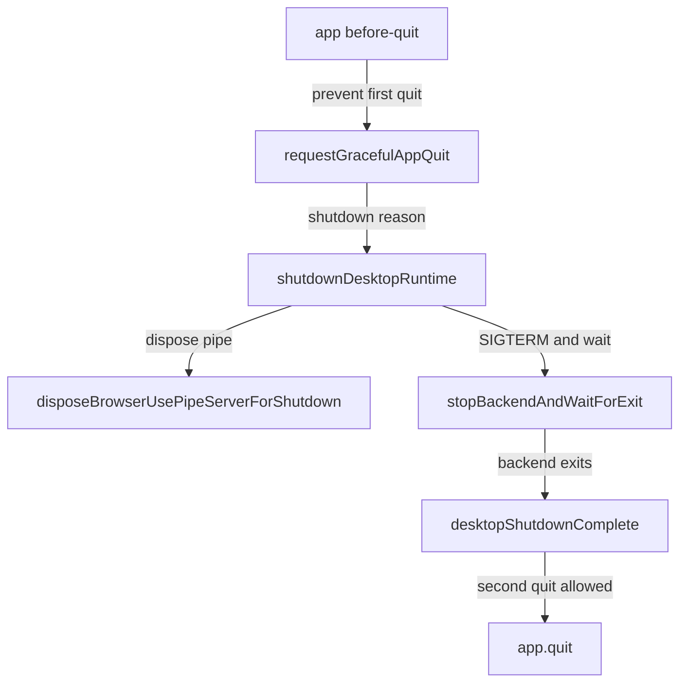

# Recap: Desktop Backend Shutdown

> Generated: 2026-05-23 | Scope: 2 files

---

## Summary

The goal was to investigate why Synara could appear to consume many gigabytes of memory with only one visible chat. The diagnosis found stale provider subprocesses, especially orphaned `kilo serve` processes, and the code change makes Electron wait for backend shutdown instead of exiting immediately after sending `SIGTERM`. Desktop package tests pass.

---

## Files Affected

| File                                     | Status   | Role                                                           |
| ---------------------------------------- | -------- | -------------------------------------------------------------- |
| `apps/desktop/src/main.ts`               | Modified | Waits for backend cleanup during app quit and signal shutdown. |
| `docs/RECAP-desktop-backend-shutdown.md` | Created  | Captures the implementation recap.                             |

---

## Logic Explanation

### Problem

Synara launches a backend process, and the backend launches provider runtimes such as Codex app-server and OpenCode-compatible servers like Kilo. The old Electron quit path sent `SIGTERM` to the backend but let Electron continue quitting immediately, so the delayed force-kill and provider cleanup path could be cut short.

### Approach

The desktop main process now treats app quit as a bounded async shutdown. It prevents the first `before-quit`, waits for backend cleanup, disposes browser-use pipe state, then calls `app.quit()` again once shutdown is complete.

### Step-by-step

1. `BACKEND_FORCE_KILL_DELAY_MS` and `BACKEND_SHUTDOWN_TIMEOUT_MS` centralize the backend shutdown budget.
2. `stopBackendAndWaitForExit` gives the backend time to run finalizers, then sends `SIGKILL` before the overall timeout if it still has not exited.
3. `shutdownDesktopRuntime` clears update/readiness timers, disposes the browser-use pipe server, waits for backend exit, disposes the browser manager, and restores stdio capture.
4. `before-quit`, `SIGINT`, and `SIGTERM` all route through `requestGracefulAppQuit`, so normal quits and signal-based quits use the same cleanup path.

### Tradeoffs & Edge Cases

Quit can now wait up to ten seconds when the backend is stuck, but that is bounded and gives provider child processes a real chance to exit cleanly. If cleanup fails, the app still proceeds with quit after logging the failure.

---

## Flow Diagram

### Happy Path

---

## High School Explanation

Think of Synara like a teacher leaving a classroom. The teacher also has helpers doing work in side rooms. Before this change, the teacher shouted "pack up" and walked out right away, so some helpers could keep sitting in those side rooms all night.

Now the teacher waits at the door for a short time. The helpers get a chance to leave properly. If someone still refuses to leave, the teacher closes the room after a fixed timeout so the building does not stay open forever.
