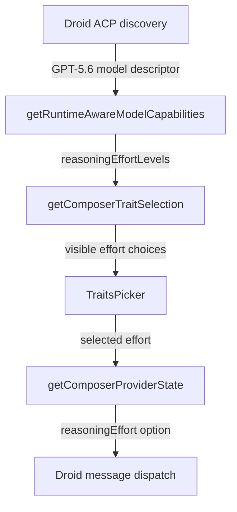

# Recap: Droid GPT-5.6 Effort Selection

> Generated: 2026-07-13 | Scope: 4 files

---

## Summary

The Droid composer could not show reasoning effort choices for runtime-only GPT-5.6 models. The web capability bridge now accepts Droid's discovered effort ladder, and dispatch validation uses the same runtime-aware capabilities. A focused regression test confirms the CLI's `none` through `max` choices are visible and preserved when sending.

---

## Files Affected

| File                                                             | Status      | Role                                                                |
| ---------------------------------------------------------------- | ----------- | ------------------------------------------------------------------- |
| `apps/web/src/components/chat/runtimeModelCapabilities.ts`       | ✏️ Modified | Allows Droid to consume runtime-discovered reasoning efforts        |
| `apps/web/src/components/chat/composerProviderRegistry.tsx`      | ✏️ Modified | Validates Droid dispatch options against runtime-aware capabilities |
| `apps/web/src/components/chat/composerProviderRegistry.test.tsx` | ✏️ Modified | Covers GPT-5.6 effort visibility, selection, and dispatch           |
| `docs/RECAP-droid-gpt-5-6-effort.md`                             | ✅ Created  | Records the implementation and verification                         |

---

## Logic Explanation

### Problem

Droid's ACP discovery returned model-specific reasoning efforts, but the shared web capability bridge did not include Droid in its dynamic-provider allowlist. GPT-5.6 had no static Droid entry, so the composer received an empty effort list and hid the control.

### Approach

The capability bridge now treats Droid like the other providers with runtime model catalogs. Dispatch normalization also reads the already-resolved runtime-aware capabilities instead of consulting only the static Droid model table.

### Step-by-step

1. Droid discovery supplies a `ProviderModelDescriptor` containing the GPT-5.6 effort ladder (`none`, `low`, `medium`, `high`, `xhigh`, `max`) and the `medium` default.
2. `getRuntimeAwareModelCapabilities` converts that runtime ladder into composer capabilities for Droid.
3. `getComposerTraitSelection` exposes those choices to the effort picker.
4. `getComposerProviderState` validates the selected effort against the same capabilities and preserves a non-default choice for dispatch.
5. The regression test verifies the visible choices, active selection, rendered picker, and outgoing option.

### Tradeoffs & Edge Cases

Static Droid models still retain their existing fallback capabilities when discovery is absent or returns no efforts. Default effort choices remain omitted from dispatch, preserving the current behavior of letting Droid use its model default.

---

## Flow Diagram

### Happy Path

---

## High School Explanation

Imagine Droid gives Synara a menu for GPT-5.6 with choices like Low, Medium, High, and Extra High. Synara received that menu but forgot that Droid was allowed to use it, so it showed nothing. Now Droid is on the allowed list. Synara displays the choices and remembers the one you picked when it sends your message.
