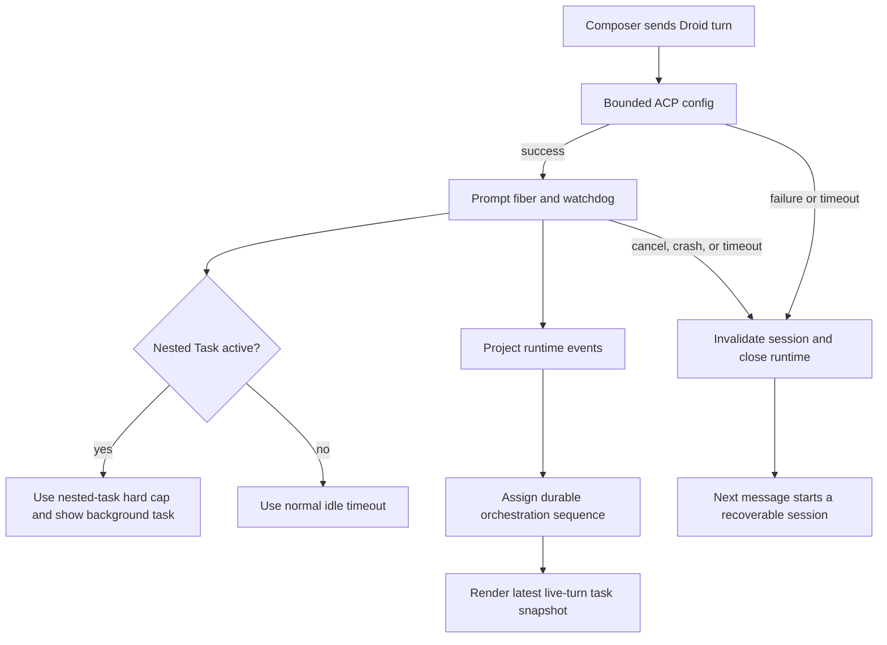

# Droid Reliability and Task-State Fixes

## Summary

This change hardens the Droid ACP integration after PR #313. It fixes dead-session reuse, silent resume fallback, stale-turn cancellation, nested-worker cleanup, unbounded ACP calls, discovery process churn, model/effort drift, and task-list ordering. It also restores the Windows process regression job and adds focused regression coverage.

## Files Affected

- `apps/server/src/provider/Layers/DroidAdapter.ts` and ACP helpers: session lifecycle, cancellation, timeouts, nested Task state, discovery single-flight, and runtime model metadata.
- `apps/server/src/orchestration` and `apps/server/src/persistence`: failed-import cleanup plus durable activity ordering and migration 053.
- `apps/web/src/components`, `apps/web/src/hooks`, `apps/web/src/session-logic.ts`, and `apps/web/src/store.ts`: lazy Droid discovery, runtime effort selection, live task-list semantics, and deterministic event order.
- `apps/web/src/appSettings.ts` and `apps/web/src/providerModelOptions.ts`: authoritative Droid catalog behavior without unsupported custom model slugs.
- `packages/contracts/src/model.ts` and `packages/shared/src/model.ts`: open-ended Droid effort transport and current GPT-5.5/GPT-5.6 fallback capabilities.
- `.github/workflows/ci.yml`: restored Windows process regression coverage.
- Related `*.test.ts` and `*.test.tsx` files: focused regressions for the changed behavior.

## Logic Explanation

1. Droid sessions are invalidated and removed when prompt/config transport fails, so the next message can recover with a fresh runtime.
2. A requested resume that falls back to a new native session now fails visibly instead of losing conversation context.
3. Turn-specific interrupts are accepted only for the currently active turn. Cancellation gets a bounded grace period and then closes the process group so hidden nested workers cannot continue.
4. Parent `Task` tool calls emit background-task lifecycle events and temporarily use a longer, finite idle cap.
5. Start, config, mode, fork, model discovery, and command discovery calls have bounded timeouts; discovery is serialized and no longer starts from unrelated UI surfaces.
6. Runtime Droid effort values are preserved as strings, live ACP catalogs are authoritative, and static GPT-5.5/GPT-5.6 ladders match Droid 0.170.0.
7. Activity rows use the durable orchestration sequence. Migration 053 backfills legacy rows, preventing same-millisecond UUID ordering from regressing a completed plan to an older snapshot.
8. The pinned checklist now represents only the live turn, so an incomplete plan cannot remain stuck across later turns.

## Flow Diagram

## High School Explanation

Synara used to trust Droid too long in some places and stop trusting it too early in others. A crashed Droid could stay registered as if it were alive, while a quiet child agent could be mistaken for a frozen process. Old stop requests could also hit a newer message, and plan updates created in the same millisecond could appear in the wrong order. The new code gives every operation a clear deadline, matches stop requests to the correct turn, closes hidden workers when needed, and gives every UI update a reliable order number. The model picker now shows the effort levels Droid actually reports: GPT-5.6 includes `max` (shown as Maximum), GPT-5.5 fast is a separate model, and GPT-5.6 has no fast model in Droid 0.170.0.
