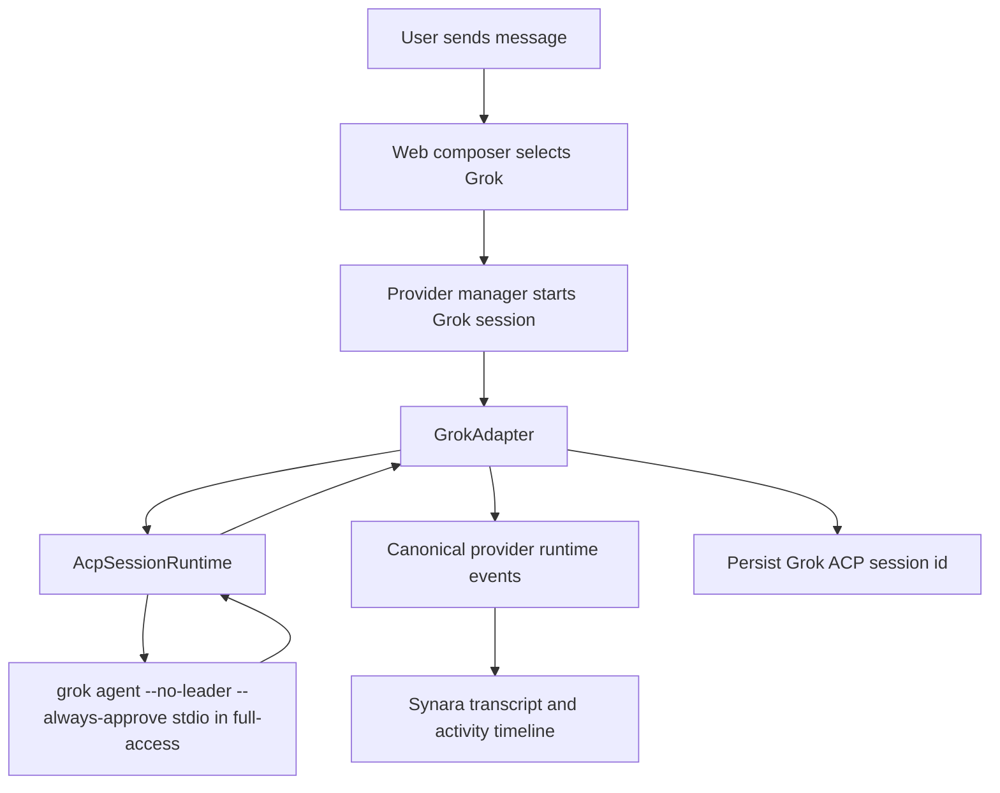

# Grok Provider Recap

## Summary

Implemented Grok as a first-class Synara provider using xAI's ACP entrypoint, `grok agent --no-leader stdio`. Full-access sessions add Grok's `--always-approve` agent flag before `stdio`, matching the CLI's flag parsing. The integration follows the same provider architecture used by the existing agent backends: server-side adapter registration, persisted resume state, model selection, approval handling, transcript event projection, UI provider selection, settings, icons, handoff, and focused test coverage.

## Files Affected

- `apps/server/src/provider/Layers/GrokAdapter.ts`: new Grok ACP provider adapter.
- `apps/server/src/provider/acp/GrokAcpSupport.ts`: Grok ACP process, auth, model, and reasoning support.
- `apps/server/src/provider/acp/AcpSessionRuntime.ts`: dynamic ACP auth method selection and authenticate metadata.
- `apps/server/src/provider/Layers/ProviderHealth.ts`: Grok CLI discovery, binary-path support, version parsing, and auth status.
- `packages/contracts/src/model.ts`, `packages/contracts/src/orchestration.ts`, `packages/contracts/src/settings.ts`: Grok provider contracts, model options, defaults, and settings schema.
- `packages/shared/src/model.ts`: Grok model normalization and alias support.
- `apps/web/src/appSettings.ts`, `apps/web/src/components/ChatView.tsx`, `apps/web/src/components/Icons.tsx`, `apps/web/src/components/chat/*`: Grok settings, model picker, composer wiring, runtime model query, and icon display.
- `apps/web/src/lib/threadHandoff.ts`, `apps/web/src/session-logic.ts`, `apps/web/src/store.ts`: provider availability, handoff, and legacy provider normalization.
- Tests across `apps/server`, `apps/web`, `packages/contracts`, and `packages/shared` cover provider registration, health checks, settings, model options, handoff, composer dispatch, and ACP support.

## Logic Explanation

Grok sessions now start through the shared ACP runtime with the command `grok agent --no-leader stdio`, plus `--always-approve` for Synara full-access sessions and `-m <model>` / `--reasoning-effort <effort>` when selected. During ACP initialization, Synara chooses the best auth method exposed by the CLI: `xai.api_key` when `GROK_CODE_XAI_API_KEY` is present, otherwise `cached_token` when the user has already logged in through the CLI. The adapter stores the Grok ACP session id in the existing provider resume cursor so Synara can resume the same conversation after restarts.

The Grok adapter maps ACP session updates into Synara runtime events for assistant text, tool activity, plans, approvals, usage, cancellation, and completion. Permission requests are routed through the existing approval flow, with full-access sessions also auto-allowing the ACP allow option if Grok asks anyway. If a tool fails and Grok reports the prompt as cancelled, Synara now marks the turn failed with the tool error instead of showing a silent cancelled turn. Model selection displays as `Grok 4.3` while using the CLI slug `grok-build`, supports known aliases, discovers the CLI's model list through `grok models`, and passes model plus reasoning effort as `grok agent` startup options. Current Grok CLI ACP (`0.1.210`) advertises model state but does not implement `session/set_config_option`, so Synara restarts the session when Grok model options change instead of attempting an unsupported in-session config switch.

The web app treats Grok like the other provider choices: it appears in provider pickers, settings, plugin/provider panels, sidebar/header badges, custom models, custom binary path settings, runtime model loading, and thread handoff targets.

## Flow Diagram

## High School Explanation

Synara can now talk to Grok the same way it talks to other coding agents. When you pick Grok, the server starts the Grok command-line tool in its official agent mode, sends your prompt to it, listens for text and tool updates, and shows those updates in the normal chat UI. If Grok asks for permission to run something, Synara uses the same approval controls you already see for other providers. If the app restarts, Synara keeps enough session information to reconnect to the same Grok conversation when possible.
