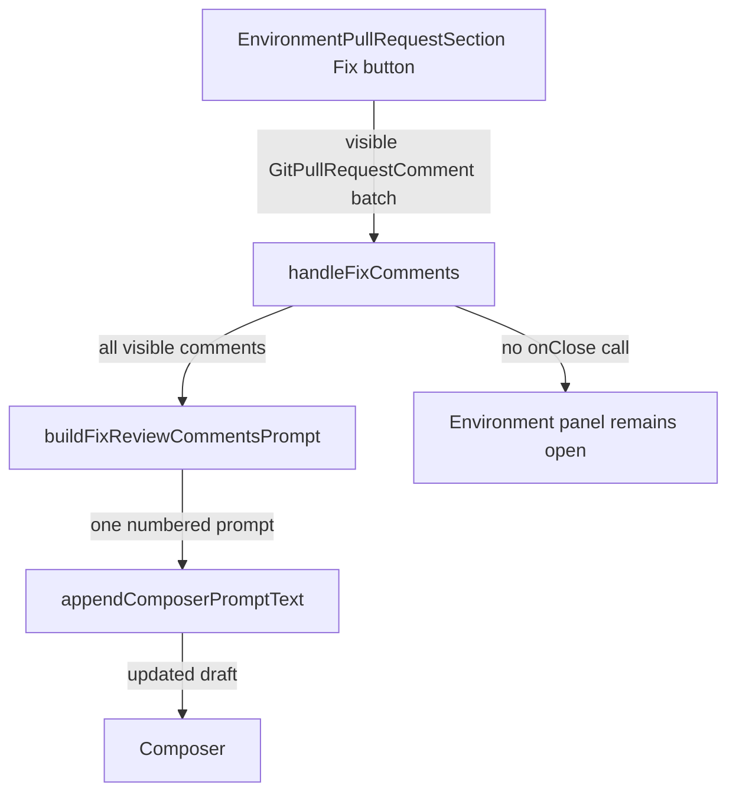

# Recap: PR Fix Keeps Environment Open

> Generated: 2026-07-09 | Scope: 4 files changed

---

## Summary

The goal was to keep PR Fix context visible and make the review prompt concise. The review area retains one Fix button that groups all visible unresolved comments into one numbered composer prompt, while merge-conflict Fix keeps its dedicated prompt; neither action closes the Environment panel.

---

## Files Affected

| File                                                                                 | Status   | Role                                                                               |
| ------------------------------------------------------------------------------------ | -------- | ---------------------------------------------------------------------------------- |
| `apps/web/src/components/chat/environment/EnvironmentPullRequestSection.tsx`         | Modified | Keeps one aggregate review Fix button and leaves the panel open after Fix actions. |
| `apps/web/src/components/chat/environment/environmentPullRequest.logic.ts`           | Modified | Builds one concise, bounded prompt containing all visible review comments.         |
| `apps/web/src/components/chat/environment/environmentPullRequest.logic.test.ts`      | Modified | Verifies grouped prompt content and its size limit.                                |
| `apps/web/src/components/chat/environment/EnvironmentPullRequestSection.browser.tsx` | Created  | Verifies both visible comments are drafted together and the panel remains open.    |

---

## Logic Explanation

### Problem

The PR Fix handlers invoked `onClose`, making the Environment panel disappear after drafting. The aggregate review prompt also used more instruction text than needed for the simple job of handing all currently visible findings to the agent.

### Approach

The fix removes the close side effect only from actions that hand work to the composer. The comments summary retains one sibling Fix button, which passes the complete visible comment batch to a shorter numbered prompt; existing navigation links still close the panel.

### Step-by-step

1. The comments summary continues to open the popup, while one sibling Fix button remains available for the whole batch.
2. `handleFixComments` passes every visible comment to `buildFixReviewCommentsPrompt`, which emits one heading followed by numbered comments with file, URL, author, and bounded bodies.
3. `handleResolveConflicts` continues to append its merge-conflict prompt without changing panel state.
4. The browser test clicks the single review Fix, verifies both fixture comments reach the same composer draft, and verifies `onClose` was never called.

### Tradeoffs & Edge Cases

The prompt retains one compact warning that quoted review text is untrusted, but intentionally avoids a workflow or checklist. It embeds at most 20 comments and points back to the PR when more may exist. Navigation actions continue to close the panel because they move to another surface.

---

## Flow Diagram

### Happy Path

---

## High School Explanation

Imagine a teacher leaves several notes on different parts of your homework. One Fix button now copies all those notes into a single numbered task and leaves the notes panel open so you can keep reading. The task stays short and direct instead of adding a long set of instructions. Links still close the panel when they intentionally take you somewhere else.
