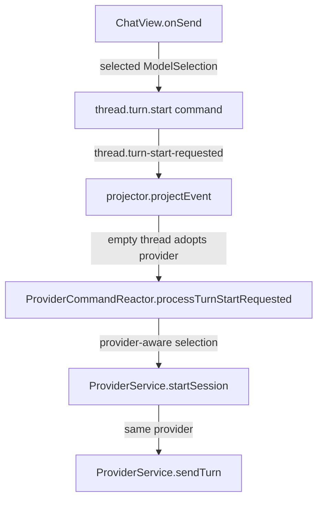
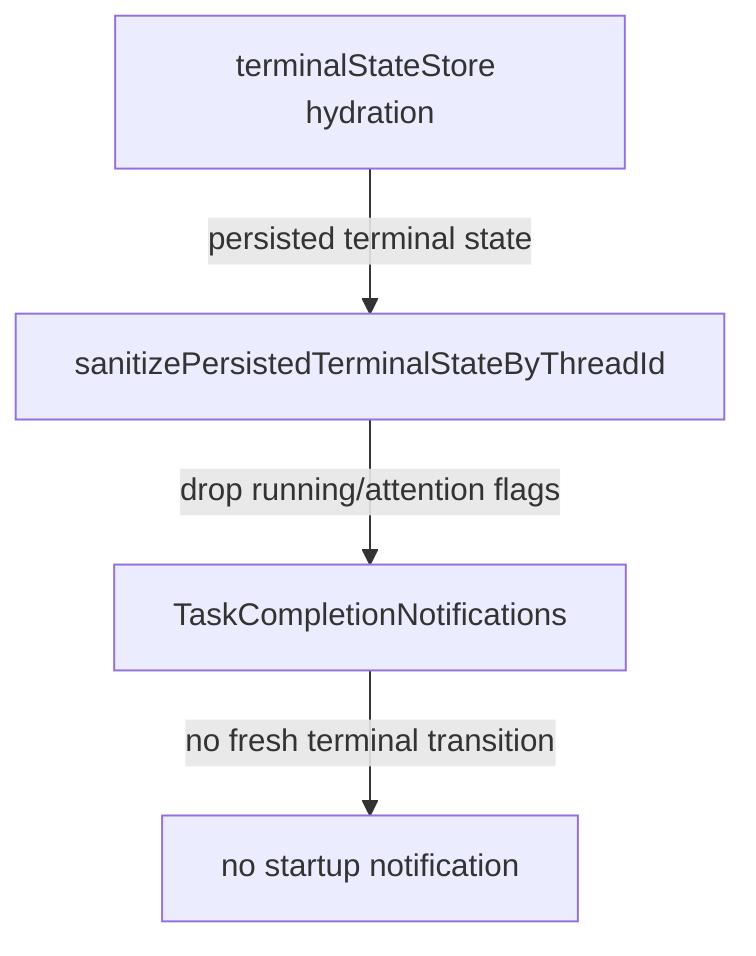

# Recap: Provider Routing And Startup Notifications

> Generated: 2026-05-21 | Scope: 11 files

---

## Summary

The goal was to investigate noisy Linux startup notifications and provider routing bugs where Synara fell back to Codex after a non-Codex first turn. The change removes Linux native menu accelerators that can surface as keybinding notifications, stops stale terminal runtime state from replaying old notifications, and keeps first-turn provider selection bound to the provider the user actually picked. Provider-specific title/branch generation now avoids calling Codex for providers that do not have a text-generation adapter.

---

## Files Affected

| File                                                                  | Status   | Role                                                                  |
| --------------------------------------------------------------------- | -------- | --------------------------------------------------------------------- |
| `apps/desktop/src/main.ts`                                            | Modified | Applies platform-aware menu accelerator props.                        |
| `apps/desktop/src/menuShortcuts.ts`                                   | Modified | Centralizes Linux accelerator suppression.                            |
| `apps/desktop/src/menuShortcuts.test.ts`                              | Modified | Covers Linux and non-Linux accelerator behavior.                      |
| `apps/server/src/orchestration/Layers/ProviderCommandReactor.ts`      | Modified | Routes title/branch text generation only to supported providers.      |
| `apps/server/src/orchestration/Layers/ProviderCommandReactor.test.ts` | Modified | Covers Gemini fallback titles and first-turn provider adoption.       |
| `apps/server/src/orchestration/projector.ts`                          | Modified | Allows an empty thread to adopt the requested provider on first turn. |
| `apps/server/src/orchestration/projector.test.ts`                     | Modified | Covers first-turn provider adoption in projection.                    |
| `apps/web/src/components/ChatView.tsx`                                | Modified | Blocks send attempts when the selected provider is known unavailable. |
| `apps/web/src/terminalStateStore.ts`                                  | Modified | Removes volatile terminal runtime flags from persisted state.         |
| `apps/web/src/terminalStateStore.test.ts`                             | Modified | Covers persisted terminal state sanitization.                         |
| `docs/RECAP-provider-notifications.md`                                | Created  | Captures the implementation recap.                                    |

---

## Logic Explanation

### Problem

Linux startup could produce repeated native notifications related to keybindings or old terminal attention state. Separately, first turns sent with a non-Codex provider could leave the thread projected as Codex, so the second turn tried Codex and failed.

### Approach

Native Electron menu accelerators are disabled on Linux because the web app already handles these shortcuts and some Linux desktops expose accelerator registration as notifications. Terminal runtime flags are treated as volatile UI state, so persisted state keeps layout and titles but drops stale running/attention markers.

### Step-by-step

1. `resolveDesktopMenuAccelerator` returns no custom accelerator on Linux, and `configureApplicationMenu` uses it for the six custom menu shortcuts.
2. `sanitizePersistedTerminalStateByThreadId` strips `runningTerminalIds` and `terminalAttentionStatesById` during persistence and hydration, preventing old terminal states from looking new at startup.
3. `projectEvent` now allows `thread.turn-start-requested` to update `modelSelection` when a thread has no session and no previous turn.
4. `ProviderCommandReactor` now passes Cursor, Kilo, and OpenCode selections to provider-aware text generation, keeps Codex on Codex, and skips model-based title/branch generation for unsupported providers like Gemini.
5. `ChatView` checks the selected provider status before dispatching, so an unavailable provider fails once at the composer instead of producing a cascade of provider errors.

### Tradeoffs & Edge Cases

Linux loses native menu-displayed accelerators for the custom shortcuts, but the actual shortcuts remain handled by the web layer. Unsupported providers use deterministic fallback titles instead of AI-generated titles, which is less polished but avoids accidentally invoking Codex.

---

## Flow Diagram

### Happy Path

### Startup Notification Path

---

## High School Explanation

Think of each chat like a group project with one chosen teammate. If you choose OpenCode, the app should not secretly hand the second message to Codex. Now the first message writes the teammate's name on the project folder, so every next message goes to the same teammate.

The startup notifications were like old sticky notes left on a desk. The app was picking them up in the morning and acting like they were brand-new. Now it keeps useful desk layout stuff, but throws away old "needs attention" sticky notes when saving and loading.
